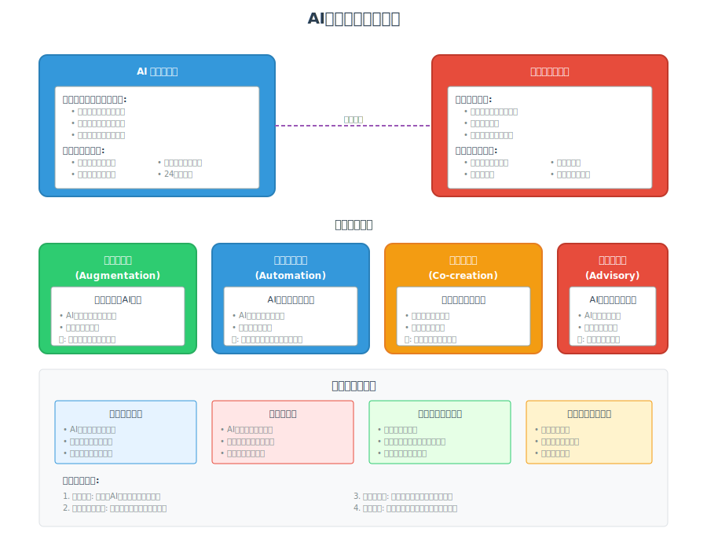
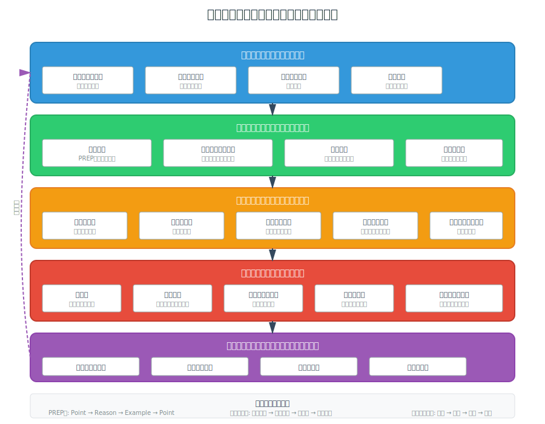
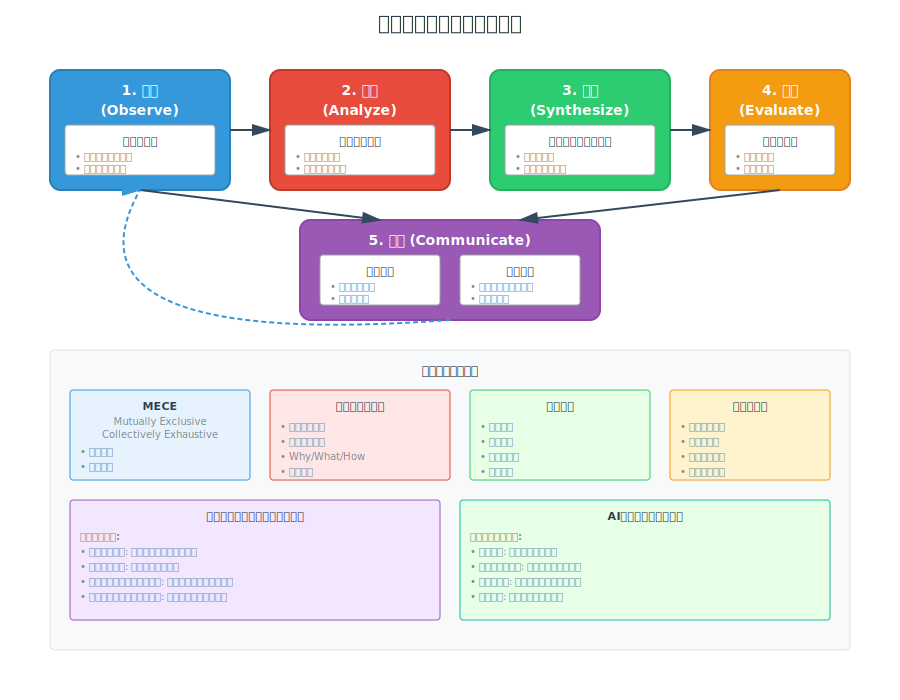

<!-- markdownlint-disable MD033 -->

# 付録D：図版索引

この索引は、`docs/assets/images/diagrams/` に公開されているSVG 9件を、読者が直接確認できる形でまとめたものです。各項目には安定アンカー、代替テキスト、キャプション、用途、関連章を付けています。

## D.0 図版の位置づけ

ここに掲載する図版はすべて**概念図・説明用のイラスト**です。図中の数値、年代、段階、矢印、役割分担は考え方を説明するための例であり、実測効果、導入効果、性能、成功率、将来予測、組織に対する保証を表しません。実務で判断する場合は、対象業務の一次情報、評価基準、契約・社内ルール、承認者を別途確認してください。

図版を読み取れない場合は、キャプションと用途、関連章のテキストを使って本文へ戻ってください。SVGファイル名と以下の安定アンカーは、リンクやレビュー記録から参照するために変更しない契約です。

## D.1 全図版一覧

| ID | ファイル | 主な用途 | 関連章 |
| --- | --- | --- | --- |
| [figure-ai-era-decision-framework](#figure-ai-era-decision-framework) | `ai-era-decision-framework.svg` | AI時代の判断フレームの全体像 | [第1章](../../chapters/chapter01/)、[第4章](../../chapters/chapter04/)、[第6章](../../chapters/chapter06/) |
| [figure-ai-human-collaboration](#figure-ai-human-collaboration) | `ai-human-collaboration.svg` | AIと人間の能力・確認の組み合わせ | [第6章](../../chapters/chapter06/)、[第15章](../../chapters/chapter15/) |
| [figure-ai-workflow-change](#figure-ai-workflow-change) | `ai-workflow-change.svg` | AI導入で変わる業務フローの見取り図 | [第8章](../../chapters/chapter08/)、[第16章](../../chapters/chapter16/) |
| [figure-deduction-induction-comparison](#figure-deduction-induction-comparison) | `deduction-induction-comparison.svg` | 演繹と帰納の使い分け | [第2章](../../chapters/chapter02/)、[第3章](../../chapters/chapter03/) |
| [figure-expression-communication-model](#figure-expression-communication-model) | `expression-communication-model.svg` | 情報を伝達可能な成果物へ変換する層 | [第10章](../../chapters/chapter10/)、[第11章](../../chapters/chapter11/) |
| [figure-human-ai-collaboration-thinking](#figure-human-ai-collaboration-thinking) | `human-ai-collaboration-thinking.svg` | 人間の思考とAI支援を分担する考え方 | [第1章](../../chapters/chapter01/)、[第5章](../../chapters/chapter05/)、[第9章](../../chapters/chapter09/) |
| [figure-human-ai-role-distribution](#figure-human-ai-role-distribution) | `human-ai-role-distribution.svg` | 人間とAIの役割分担・責任分界 | [第9章](../../chapters/chapter09/)、[第15章](../../chapters/chapter15/) |
| [figure-logical-thinking-framework-enhanced](#figure-logical-thinking-framework-enhanced) | `logical-thinking-framework-enhanced.svg` | 論理的思考の拡張フレーム | [第2章](../../chapters/chapter02/)、[第4章](../../chapters/chapter04/) |
| [figure-logical-thinking-framework](#figure-logical-thinking-framework) | `logical-thinking-framework.svg` | 観察・分析・統合をたどる基本フレーム | [第2章](../../chapters/chapter02/)、[第3章](../../chapters/chapter03/) |

## D.2 AI時代の判断

### ai-era-decision-framework

<figure id="figure-ai-era-decision-framework">

<figcaption>AI時代の意思決定フレームワーク。概念図・説明用のイラストであり、効果や判断結果を保証するものではありません。</figcaption>
</figure>

| 項目 | 内容 |
| --- | --- |
| **用途** | 目的と情報を先に定義し、AI出力の評価と人間の承認を経て判断する流れを説明します。 |
| **関連章** | [第1章：なぜ今、論理的思考が必要なのか](../../chapters/chapter01/)、[第4章：問題解決の論理プロセス](../../chapters/chapter04/)、[第6章：AIの出力を評価・改善する](../../chapters/chapter06/) |

## D.3 AIと人間の協働

### ai-human-collaboration

<figure id="figure-ai-human-collaboration">

<figcaption>AIと人間の協働モデル。概念図・説明用のイラストであり、能力差や効果を測定した図ではありません。</figcaption>
</figure>

| 項目 | 内容 |
| --- | --- |
| **用途** | AIに任せる作業と、人間が確認・承認する作業を切り分ける際の説明に使います。 |
| **関連章** | [第6章：AIの出力を評価・改善する](../../chapters/chapter06/)、[第15章：論理的思考を活かしたリーダーシップ](../../chapters/chapter15/) |

### human-ai-collaboration-thinking

<figure id="figure-human-ai-collaboration-thinking">

<figcaption>人間とAIの協働思考。概念図・説明用のイラストであり、思考力や生産性の向上を保証するものではありません。</figcaption>
</figure>

| 項目 | 内容 |
| --- | --- |
| **用途** | 問いの設定、AIによる候補整理、人間による根拠確認と判断を反復する考え方を示します。 |
| **関連章** | [第1章：なぜ今、論理的思考が必要なのか](../../chapters/chapter01/)、[第5章：AIへの指示（プロンプト）設計](../../chapters/chapter05/)、[第9章：AIリスク管理と倫理的配慮](../../chapters/chapter09/) |

### human-ai-role-distribution

<figure id="figure-human-ai-role-distribution">

<figcaption>人間とAIの役割分担。概念図・説明用のイラストであり、特定の組織における最適な分担や責任範囲を保証するものではありません。</figcaption>
</figure>

| 項目 | 内容 |
| --- | --- |
| **用途** | AIの補助範囲と人間の確認・承認・責任の境界を、チームで合意する際のたたき台にします。 |
| **関連章** | [第9章：AIリスク管理と倫理的配慮](../../chapters/chapter09/)、[第15章：論理的思考を活かしたリーダーシップ](../../chapters/chapter15/) |

## D.4 業務フローと成果物

### ai-workflow-change

<figure id="figure-ai-workflow-change">

<figcaption>AI導入による業務フローの変化。概念図・説明用のイラストであり、導入期間や削減効果を示す実測図ではありません。</figcaption>
</figure>

| 項目 | 内容 |
| --- | --- |
| **用途** | AIを単独の自動化機能としてではなく、入力分類、レビュー、承認、ログ化を含む業務フローとして設計する際に使います。 |
| **関連章** | [第8章：AI活用の具体的場面](../../chapters/chapter08/)、[第16章：プロジェクト管理と問題解決](../../chapters/chapter16/) |

### expression-communication-model

<figure id="figure-expression-communication-model">

<figcaption>表現とコミュニケーションのモデル。概念図・説明用のイラストであり、伝達効果や理解度を保証するものではありません。</figcaption>
</figure>

| 項目 | 内容 |
| --- | --- |
| **用途** | 事実や主張を、構造化、文章化、説明、対話へ変換するときの設計層を説明します。 |
| **関連章** | [第10章：論理的な文書作成](../../chapters/chapter10/)、[第11章：説得力のあるプレゼンテーション](../../chapters/chapter11/) |

## D.5 論理的思考の基本

### deduction-induction-comparison

<figure id="figure-deduction-induction-comparison">

<figcaption>演繹と帰納の比較。概念図・説明用のイラストであり、推論の正しさや結論の確実性を自動的に保証するものではありません。</figcaption>
</figure>

| 項目 | 内容 |
| --- | --- |
| **用途** | 一般原則から個別結論へ進む推論と、複数の観察から仮説を組み立てる推論を使い分ける説明に使います。 |
| **関連章** | [第2章：論理的思考の基本構造](../../chapters/chapter02/)、[第3章：情報の整理と分析](../../chapters/chapter03/) |

### logical-thinking-framework

<figure id="figure-logical-thinking-framework">

<figcaption>論理的思考の基本フレーム。概念図・説明用のイラストであり、問題解決の結果や判断の正しさを保証するものではありません。</figcaption>
</figure>

| 項目 | 内容 |
| --- | --- |
| **用途** | 観察した情報を分類・分析し、複数の材料を統合して結論と次の行動を組み立てる流れを示します。 |
| **関連章** | [第2章：論理的思考の基本構造](../../chapters/chapter02/)、[第3章：情報の整理と分析](../../chapters/chapter03/) |

### logical-thinking-framework-enhanced

<figure id="figure-logical-thinking-framework-enhanced">

<figcaption>拡張版の論理的思考フレーム。概念図・説明用のイラストであり、AI活用の成熟度や改善効果を測定・保証するものではありません。</figcaption>
</figure>

| 項目 | 内容 |
| --- | --- |
| **用途** | 論理的思考の基本工程へAI協働、検証、意思決定、改善を接続し、本文全体の関係を説明します。 |
| **関連章** | [第2章：論理的思考の基本構造](../../chapters/chapter02/)、[第4章：問題解決の論理プロセス](../../chapters/chapter04/) |

## D.6 参照時の確認事項

1. 図版の矢印や分類は、対象業務へ適用する前に自組織の目的、情報分類、承認フローへ置き換える。
2. 図版に数値や段階が描かれていても、出典のある測定値とはみなさず、実測する場合は対象、方法、期間、限界を別に記録する。
3. 図版から読み取った主張は、関連章と一次情報を確認し、必要なら [付録C：用語集](../appendix-c/) や [付録A：実践的なツール・テンプレート集](../appendix-a/) へ戻る。

<!-- markdownlint-enable MD033 -->
