# 第1章：なぜ今、論理的思考が必要なのか

## 学習目標
この章を読み終えると、以下のことができるようになります：
- 生成AI普及による働き方の変化を理解する
- AIができること・できないことを区別する
- 人間に求められるスキルの変化を認識する
- 論理的思考の定義と重要性を説明できる

## 1.1 生成AI普及による働き方の変化

### 1.1.1 2024〜2025年のAI技術動向

**大規模言語モデル（LLM）の進化**
- **GPT-4/4o**: マルチモーダル対応、長文処理能力の向上
- **Claude-3.5 Sonnet**: 推論能力の飛躍的向上、コード生成特化
- **Gemini Ultra**: Google統合環境でのリアルタイム処理
- **LLaMA 2/3**: オープンソース分野での企業向けカスタマイズ

**エンタープライズAI導入の加速**
- **Microsoft Copilot**: Office製品群への深度統合
- **Salesforce Einstein**: CRM業務の自動化・最適化
- **Adobe Firefly**: クリエイティブワークフローの革新
- **専門特化AI**: 法務、医療、金融分野での実用化

**AI倫理・ガバナンスの制度化**
- **EU AI法**: 世界初の包括的AI規制（2024年施行）
- **日本のAI戦略**: デジタル庁による官民連携推進
- **企業のAI方針**: リスク管理と責任あるAI開発の標準化

### 1.1.2 AI前後の業務変化
**AI導入前の典型的な業務フロー**
- 情報収集 → 整理 → 分析 → 資料作成 → 報告・提案

**AI導入後の業務フロー（2024年版）**
- 課題設定・文脈定義 → マルチモーダル指示 → AI協調評価 → 反復改善 → 人間最終判断

**最新のAI協働パターン**
- **AI Agent**: 自律的タスク実行による業務効率化
- **Human-in-the-Loop**: 継続的フィードバックによる品質向上
- **Multimodal Interaction**: テキスト・画像・音声の統合処理

### 1.1.3 変化のポイント
1. **作業の自動化**: 定型的な作業はAIが代替
2. **判断の重要性**: 人間の判断・意思決定がより重要に
3. **指示力の必要性**: AIに適切な指示を出す能力が必須
4. **評価力の重要性**: AIの出力を適切に評価する力が必要

### 1.1.4 具体例：資料作成業務の変化

**従来の資料作成（8時間）**
- 情報収集: 2時間
- データ整理: 2時間
- 文章作成: 3時間
- レイアウト調整: 1時間

**AI活用後の資料作成（3時間）**
- 課題・目的の明確化: 30分
- AIへの指示作成: 30分
- AI出力の評価・修正: 1.5時間
- 最終調整・判断: 30分

### 図1-1：AI活用による業務変化

## 1.2 AIができること・できないこと

### 1.2.1 AIが得意なこと（2024年版）

**従来から優れている領域**
- **情報の整理・要約**: 大量の情報を短時間で整理
- **パターン認識**: データから規則性を発見
- **文章生成**: 指示に基づいた文章作成
- **計算・分析**: 複雑な計算やデータ分析

**2024年に飛躍的に向上した領域**
- **複雑な推論**: 多段階の論理的思考が可能
- **マルチモーダル処理**: テキスト・画像・音声の統合理解
- **コード生成・デバッグ**: プログラミングの自動化
- **専門知識応用**: 法務・医療・金融分野での実用レベル
- **リアルタイム対話**: 自然な会話による協働作業

**新しく可能になった領域**
- **AIエージェント機能**: 自律的なタスク実行
- **長期記憶活用**: 過去の文脈を保持した継続作業
- **創造的問題解決**: 既存の枠を超えたアイデア生成

### 1.2.2 AIが苦手なこと（現在の限界）
- **最終責任判断**: 説明責任を伴う重要な意思決定
- **真の共感理解**: 人間の感情や価値観への深い理解
- **リアルタイム物理操作**: 現実世界での直接的な作業
- **組織政治の理解**: 複雑な人間関係や利害調整
- **倫理的ジレンマ**: 価値観が対立する状況での判断

### 1.2.3 AI活用の現実
**よくある誤解**
- 「AIが全部やってくれる」→ 指示と評価は人間が必要
- 「AIの答えは常に正しい」→ 検証と判断は人間の責任
- 「AIで仕事がなくなる」→ 人間の役割が変化するだけ

### 図1-2：人間とAIの役割分担

この図は、業務を三つの領域に分けて考えるための概念図です。  
「AIが単独で処理しやすい領域」「人間の最終責任が必要な領域」「人間とAIが協働して価値を最大化できる領域」を示しています。  
境界や比率は、業務内容・組織・利用しているAI（エージェント/ツール連携の有無を含む）により変動します。  
そのため、固定値として扱わないでください。

## 1.3 人間に求められるスキルの変化

### 1.3.1 重要性が増すスキル（2024年アップデート版）

**基本的人間スキル（AI時代により重要に）**
1. **問題設定・定義力**: 何を解決すべきかを見つける力
2. **批判的思考力**: AI出力を客観的に評価・検証する力
3. **創造的問題解決**: AIだけでは難しいことが多い独創的アプローチの発見
4. **倫理的判断力**: AI使用における責任ある意思決定
5. **人間関係構築力**: AIが代替しにくい信頼関係の形成

**AI協働スキル（新たに必要）**
6. **プロンプトエンジニアリング**: 効果的なAI指示設計
7. **マルチモーダル活用**: テキスト・画像・音声を統合した指示
8. **AI品質管理**: 出力の妥当性チェックと改善プロセス
9. **Human-in-the-Loop設計**: 人間とAIの最適な協働設計
10. **AI倫理・ガバナンス**: 責任あるAI利用の判断

### 1.3.2 相対的に重要性が下がるスキル
- 単純な情報収集・検索力
- 定型的な文書作成・要約力
- 反復的な計算・分析作業
- 記憶に依存した知識タスク
- 基本的なコーディング作業

### 1.3.3 完全に新しく必要になるスキル
- **AIエージェント管理**: 自律AIシステムの監督・調整
- **マルチAI統合**: 複数のAIツールを組み合わせた業務設計
- **AI説明責任**: AI判断の社会的説明と責任の取り方
- **継続学習設計**: 急速な技術変化への適応メカニズム
- **デジタル・ヒューマン・バランス**: AIと人間性のバランス調整

## 1.4 論理的思考の定義と重要性

### 1.4.1 論理的思考とは
**定義**: 筋道立てて考え、根拠に基づいて結論を導く思考方法

**構成要素**
1. **前提**: 考えの出発点となる事実や仮定
2. **推論**: 前提から結論に至る思考過程
3. **結論**: 推論の結果として導かれる答え

### 1.4.2 AI時代に論理的思考が重要な理由

**1. AIへの適切な指示のため**
- 曖昧な指示では期待する結果が得られない
- 論理的な指示構造が必要

**2. AI出力の評価のため**
- AIの答えが正しいか判断する必要
- 論理的な検証プロセスが重要

**3. 人間同士のコミュニケーションのため**
- AIが代替しにくい人間関係の構築
- 説得力のある議論の展開

**4. 意思決定の質向上のため**
- 最終的な判断は人間が行う
- 論理的根拠に基づいた意思決定が必要

### 1.4.3 論理的思考の具体例

**非論理的な指示例**
「売上を上げる方法を考えて」

**論理的な指示例**
「前年同期比で売上が15%減少している原因を分析し、来四半期で10%向上させるための具体的施策を、顧客セグメント別に3つずつ提案してください」

## 1.5 本書での学習アプローチ

### 1.5.1 学習の流れ
1. **基礎編**: 論理的思考の基本原理
2. **AI活用編**: 生成AIとの効果的な協働方法
3. **実践編**: 職場での論理的表現・コミュニケーション
4. **応用編**: チーム・組織での活用

### 1.5.2 実践重視の学習設計
- 各章に実際の業務を想定した演習
- Before/Afterの具体例で理解促進
- チェックリストでの自己診断機能

## 章末演習

### 演習1-1：AI活用の現状分析
あなたの職場でのAI活用状況を以下の観点で分析してください：
1. 現在使用しているAIツール
2. AI導入前後での業務変化
3. 感じている課題や困りごと

### 演習1-2：論理的思考の必要場面
普段の業務で「論理的に考える必要がある」と感じる場面を3つ挙げ、それぞれでどのような思考が求められるか説明してください。

### 演習1-3：AI指示の改善
以下の曖昧な指示を、より論理的で具体的な指示に改善してください：
「競合他社について調べて」

## 理解度チェック

□ 生成AI普及による働き方の変化を3つ以上説明できる
□ AIが得意なことと苦手なことを区別できる
□ 論理的思考の3つの構成要素を説明できる
□ AI時代に論理的思考が重要な理由を4つ以上説明できる

## AI時代の思考フレームワーク全体像

AI時代における論理的思考は、従来の枠組みを超えて、人間とAIの協働による新しい次元に発展しています。以下の図は、この変化を包括的に表現しています。

このフレームワークでは、従来の「構造化」「根拠・証拠」「推論」の3要素に加えて、AI時代特有の思考強化要素として以下が組み込まれています：

- **Human-AI協働**: プロンプト設計とAI出力評価の技術
- **バイアス対策**: 認知バイアスの認識とデバイアシング手法
- **データ駆動思考**: 統計的推論と証拠重視の判断
- **メタ認知**: 思考の思考による継続的改善

## 次章への橋渡し

この章では、なぜ今論理的思考が重要なのかを理解しました。次の第2章では、論理的思考の具体的な構造と方法について詳しく学んでいきます。特に、日常業務で使える実践的な思考フレームワークを習得していきましょう。
