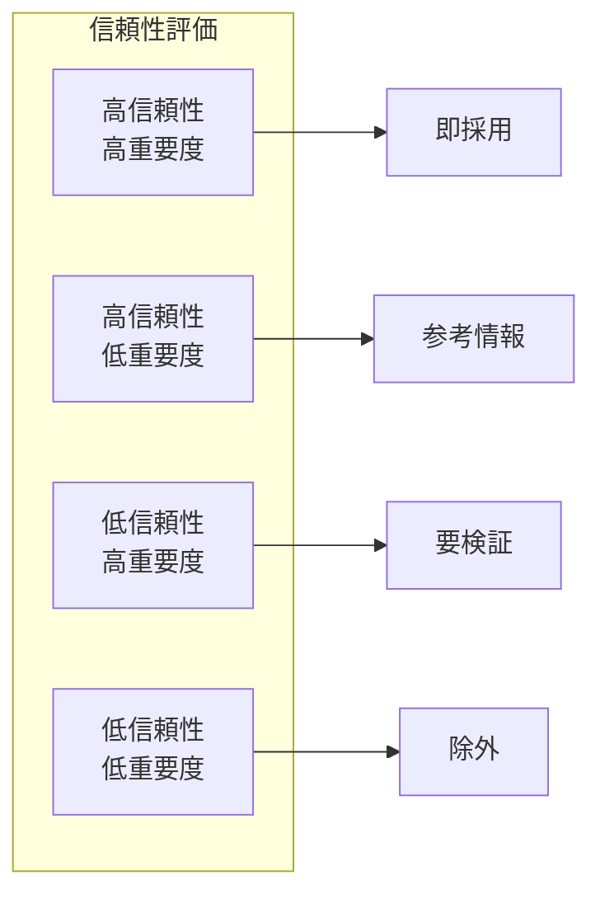

# 第3章：情報の整理と分析

## 学習目標
この章を読み終えると、以下のことができるようになります：
- 事実と意見を正確に区別する
- 情報の信頼性を適切に評価する
- データを正しく読み取り解釈する
- フレームワークを使って情報を体系的に整理する

## 3.1 事実と意見の区別

### 3.1.1 事実（Fact）とは

**定義**: 客観的に確認できる情報

**事実の特徴**
- 測定・観察可能
- 検証可能
- 主観に左右されない
- 数値・データで表現できる

**事実の例**
- 「売上が前年同期比10%減少した」
- 「会議の参加者は15名だった」
- 「商品Aの価格は5,000円である」
- 「アンケート回答者の60%が満足と回答」

### 3.1.2 意見（Opinion）とは

**定義**: 主観的な判断や解釈

**意見の特徴**
- 個人の価値観に基づく
- 解釈や推測を含む
- 人によって異なる可能性
- 感情や経験が影響

**意見の例**
- 「この商品は素晴らしい」
- 「売上減少は深刻な問題だ」
- 「彼は優秀なリーダーである」
- 「この戦略は成功するだろう」

### 3.1.3 境界線が曖昧なケース

**事実に基づく推論**
- 「売上減少の傾向が続いている」（データに基づく客観的観察）
- 「競合他社の影響が考えられる」（合理的推論）

**判断のポイント**
1. 測定・確認可能か？
2. 複数の人が同じ結論に達するか？
3. 客観的データに基づいているか？
4. 主観的評価が混入していないか？

### 3.1.4 ビジネスでの実践

**報告書での区別例**

**✗ 混在した表現**
「売上が10%減少した。これは非常に深刻な状況で、すぐに対策が必要だ。」

**✓ 明確に区別した表現**
- 事実：「売上が前年同期比10%減少した」
- 分析：「減少率は過去5年で最大である」
- 意見：「早急な対策が必要と考えます」

## 3.2 情報の信頼性評価

### 3.2.1 情報源の評価基準

**1. 権威性（Authority）**
- 情報提供者の専門性
- 組織の信頼性
- 実績と経験

**2. 正確性（Accuracy）**
- データの検証可能性
- 引用元の明記
- 数値の一貫性

**3. 客観性（Objectivity）**
- 偏見の有無
- 利害関係の有無
- 複数視点の考慮

**4. 最新性（Currency）**
- 情報の更新日
- データの鮮度
- 現状との整合性

**5. 網羅性（Coverage）**
- 情報の完全性
- 欠損データの有無
- 全体像の把握

### 3.2.2 信頼性チェックリスト

**情報源の確認**
□ 誰が発信した情報か？
□ その人・組織は専門性があるか？
□ 利害関係者ではないか？
□ 複数の独立した情報源で確認できるか？

**内容の確認**
□ 具体的なデータがあるか？
□ データの取得方法は適切か？
□ 結論の根拠は明確か？
□ 反対意見も考慮されているか？

### 3.2.3 フェイクニュース・ディープフェイク対策

**フェイクニュースの特徴と対策**

**AI時代のフェイクニュースの特徴**
- **高度な自然性**: AIによる文章生成で自然な偽情報作成
- **大量生産**: ボットによる偽情報の大量拡散
- **個人最適化**: ターゲティングによる個人向け偽情報
- **マルチメディア**: 偽の画像・動画・音声との組み合わせ

**フェイクニュース検出のチェックポイント**
```
□ 情報源は実在する組織・個人か？
□ 他の信頼できるメディアでも報道されているか？
□ 感情的・扇動的な表現が過度に使われていないか？
□ 論理的な矛盾や事実関係の不一致はないか？
□ URL、投稿者プロフィールに不審な点はないか？
```

**ディープフェイク技術への対応**

**ディープフェイクの識別方法**

**技術的検証**
- **瞬き分析**: 不自然な瞬きパターン
- **影・光源**: 照明の一貫性チェック
- **音声同期**: 口の動きと音声のズレ
- **画質分析**: 顔部分の画質の不自然さ

**内容的検証**
- **文脈確認**: 発言者の過去の主張との整合性
- **状況確認**: 場所・時間・状況の妥当性
- **複数ソース**: 同じ内容の独立した報道の存在
- **公式確認**: 本人・組織による公式発表の有無

**AI時代の情報検証ツール**

**技術支援のカテゴリ（例）**
- **逆画像検索・キーフレーム抽出**: 画像や動画の素材・再投稿の探索
- **メタデータ確認**: 撮影日時・位置情報などの確認（取得できる場合）
- **一次情報への到達**: 原典（公的機関、論文、一次発表）への参照
- **複数ソース照合**: 独立した複数の報道・発表での突合
- **真正性の検証**: 透かし・署名など、提供されている真正性情報の確認

> 注記: ツール名の羅列は更新コストが高く陳腐化しやすいため、本書ではカテゴリ中心に整理します。具体ツールは組織の利用環境に合わせて選定し、定期的に見直してください。

**検証プロセス（ステップ）**
1. **即座判断の停止**: 感情的反応を一時停止
2. **ソース確認**: 一次情報源の特定・検証
3. **クロスチェック**: 複数の独立ソースでの確認
4. **専門機関確認**: ファクトチェック機関での検証
5. **時間経過観察**: 情報の変化・修正の追跡

### 3.2.4 ネット情報の注意点（アップデート版）

**要注意サイト（一般的な傾向）**
- 個人ブログ（専門性が不明、生成AIにより大量生成されている場合がある）
- 匿名掲示板（責任の所在が不明、ボット投稿の可能性）
- 宣伝目的サイト（客観性に疑問、偽レビューの可能性）
- 古い情報（更新停止・前提条件が変わっている可能性）
- AI生成コンテンツの集約サイト（出典が不明確、転載が多い）
- ディープフェイク等の加工コンテンツを扱うサイト（真正性の検証が必要）
- エコーチェンバーが起きやすいSNS（同質情報の繰り返しに注意）

**信頼できる情報源（強化版）**
- 政府機関の公式発表（デジタル署名確認）
- 学術機関の研究結果（査読済み論文）
- 業界団体の統計データ（調査方法の透明性）
- 複数メディアでの一致した報道（独立性確認）
- **新たな信頼源**:
  - ファクトチェック機関の検証済み情報
  - ブロックチェーン認証された情報
  - 複数AI検証ツールで確認された情報

### 図3-1：情報の信頼性評価マトリクス


## 3.3 データの読み方・解釈

### 3.3.1 基本的なデータ読解

**平均値の落とし穴**
- 極端な値の影響
- 分布の形状を無視
- 中央値との違い

**例：給与データ**
- 平均年収：700万円
- 実際の分布：500万円（5人）、1500万円（1人）
- 中央値：500万円

### 3.3.2 グラフの読み方

**棒グラフ**
- 絶対値の比較に適している
- 基準線（ゼロ）の確認が重要
- 縮尺の操作に注意

**折れ線グラフ**
- 傾向変化の把握に適している
- 縦軸の範囲設定に注意
- 期間の設定による印象の違い

**円グラフ**
- 全体に占める割合の表示
- 100%の確認が重要
- 分類の妥当性を検証

### 3.3.3 統計的な注意点

**相関係数の解釈**
- 0.7以上：強い相関
- 0.3-0.7：中程度の相関
- 0.3未満：弱い相関
- 相関≠因果関係

**サンプルサイズ**
- 少ないサンプルでの一般化に注意
- 統計的有意性の確認
- 代表性の検証

**時系列データ**
- 季節性の考慮
- 長期トレンドと短期変動の区別
- 外的要因の影響

## 3.4 情報過多時代の処理技術

### 3.4.1 情報過多（Information Overload）の理解

**情報過多の現状（傾向）**
- デジタル情報量は継続的に増加している
- メールやチャット等の連絡チャネルが増え、対応の細切れが起きやすい
- SNS等の高速な情報流通により、一次情報まで辿るコストが上がる
- 情報処理疲労が起きやすく、判断品質が下がるリスクがある

> 注記: 定量データは業種・職種・組織規模で大きく変わります。必要に応じて、信頼できる一次情報・統計を参照し、現状把握に使ってください。

**情報過多が引き起こす問題**
- **決定麻痺**: 選択肢が多すぎて決められない
- **注意散漫**: 重要な情報に集中できない
- **品質低下**: 表面的な処理で深い分析ができない
- **ストレス増加**: 情報処理負荷による心理的負担

### 3.4.2 AI時代の情報フィルタリング技術

**階層的フィルタリング手法**

**レベル1: 自動フィルタリング**
- **AIキュレーション**: 関心領域に基づく自動選別
- **重要度スコアリング**: 情報の重要度を数値化
- **重複除去**: 同じ内容の情報を自動統合
- **ノイズフィルタ**: 無関係な情報の除外

**レベル2: 半自動フィルタリング**
- **ルールベース分類**: 事前設定ルールによる分類
- **キーワード抽出**: 重要用語の自動識別
- **要約生成**: 長文の自動要約
- **優先度付け**: 文脈に基づく優先順位設定

**レベル3: 人間判断フィルタリング**
- **戦略的判断**: ビジネス戦略との整合性確認
- **倫理的評価**: 社会的・倫理的観点での評価
- **創造的活用**: 新しい価値創造への活用可能性
- **リスク評価**: 情報利用によるリスク評価

### 3.4.3 効率的情報処理テクニック

**Time-Boxing法（時間制限処理）**
- **15分ルール**: 初回処理は15分以内
- **Pomodoro応用**: 25分集中+5分休憩サイクル
- **情報断食**: 定期的な情報摂取停止時間
- **デジタルデトックス**: 週末等の完全オフライン時間

**情報の3分類処理法**
1. **即処理**: 5分以内で処理可能な情報
2. **後処理**: 重要だが時間のかかる情報（スケジュール化）
3. **削除**: 不要・無関係な情報（即座に削除）

**AI支援による情報要約技術**

**自動要約の活用**
- **抽出型要約**: 重要文の自動抽出
- **生成型要約**: 内容を理解した新しい要約文生成
- **多文書要約**: 複数文書を統合した総合要約
- **構造化要約**: フレームワークに基づく要約

**要約品質の評価基準**
```
□ 元情報の主要ポイントが含まれているか？
□ 論理的な流れが保たれているか？
□ 必要な具体例・数値が含まれているか？
□ 結論・提案が明確に示されているか？
□ 読み手にとって理解しやすいか？
```

### 3.4.4 情報過多対策の実践的ワークフロー

**1. 情報収集段階**
```
目的設定 → 収集範囲限定 → 自動収集設定 → 品質基準設定
```

**2. 情報選別段階**
```
自動フィルタ → キーワード検索 → 重要度判定 → 3分類処理
```

**3. 情報処理段階**
```
要約作成 → 構造化整理 → 知識統合 → アクション抽出
```

**4. 情報活用段階**
```
意思決定活用 → 他者共有 → 継続監視 → 学習改善
```

**情報過多対策チェックリスト**
```
□ 収集目的は明確か？
□ 自動フィルタは適切に設定されているか？
□ 処理時間の上限は設定されているか？
□ 重要度判定基準は明確か？
□ 定期的な見直しプロセスはあるか？
```

## 3.5 フレームワークを使った整理術

### 3.5.1 MECE（Mutually Exclusive, Collectively Exhaustive）

**定義**: 重複なく、漏れなく分類する手法

**MECEの条件**
- **ME（重複なし）**: 各項目が互いに重複しない
- **CE（漏れなし）**: 全体を網羅している

**MECEの例**
- 顧客分類：「新規」「既存」「休眠」
- 売上分析：「商品別」「地域別」「時期別」
- 問題分類：「緊急度×重要度」の2×2マトリックス

**MECEでない例**
- ×「20代」「30代」「若年層」（重複あり）
- ×「営業」「開発」（管理部門が漏れ）

### 3.5.2 ロジックツリー

**構造**
```
メインテーマ
├── 大分類1
│   ├── 小分類1-1
│   │   ├── 詳細1-1-1
│   │   └── 詳細1-1-2
│   └── 小分類1-2
├── 大分類2
└── 大分類3
```

**作成のポイント**
1. 上位概念から下位概念への分解
2. 各レベルでMECEを維持
3. 目的に応じた分類軸の選択
4. 実行可能な粒度まで分解

**活用例：売上向上策**
```
売上向上
├── 既存顧客
│   ├── 購入頻度向上
│   └── 購入単価向上
├── 新規顧客
│   ├── 認知度向上
│   └── 購入率向上
└── 休眠顧客
    └── 復活施策
```

### 3.5.3 5W1H

**構成要素**
- **Who**: 誰が（主体）
- **What**: 何を（対象・内容）
- **When**: いつ（時期）
- **Where**: どこで（場所）
- **Why**: なぜ（理由・目的）
- **How**: どのように（方法・手段）

**活用場面**
- 問題の整理
- 企画の立案
- 報告の構成
- 課題の分析

### 3.5.4 重要度×緊急度マトリックス

**4象限での分類**
```
重要度高 | A：重要かつ緊急    | B：重要だが非緊急
        | (危機管理)       | (予防・改善)
---------|-----------------|------------------
重要度低 | C：重要でないが緊急 | D：重要でも緊急でもない
        | (割り込み作業)   | (無駄な作業)
        緊急度低         緊急度高
```

**優先順位**
1. A象限：最優先で対応
2. B象限：計画的に対応
3. C象限：効率化・委譲
4. D象限：排除・削減

## 3.6 情報整理の実践プロセス

### 3.6.1 情報収集段階

**収集方針の設定**
1. 目的の明確化
2. 必要情報の特定
3. 収集方法の選択
4. 品質基準の設定

**情報源の多様化**
- 一次情報（調査・インタビュー）
- 二次情報（既存資料・統計）
- 内部情報（社内データ）
- 外部情報（業界レポート）

### 3.6.2 整理・分析段階

**段階的整理法**
1. **分類**: フレームワークを使った分類
2. **評価**: 信頼性・重要度の評価
3. **統合**: 関連情報の統合
4. **解釈**: パターンや傾向の発見

**分析の深化**
- 表面的事実の把握
- 背景・原因の分析
- 影響・結果の予測
- 対策・提案の検討

### 3.6.3 活用段階

**情報の価値最大化**
- 意思決定への活用
- 他部署との共有
- 継続的な更新
- 学習・改善への反映

## 章末演習

### 演習3-1：事実と意見の区別
以下の文章から事実と意見を分離してください：

「今四半期の売上は1,000万円で、前年同期の1,200万円から200万円減少した。この減少は非常に深刻で、競合他社の影響だと考えられる。すぐに対策を講じなければ、来四半期はさらに悪化するだろう。」

### 演習3-2：情報の信頼性評価
以下の情報源を信頼性の観点から評価してください：
1. 業界団体が発表した市場規模データ
2. 競合他社の営業担当者からの情報
3. 政府統計による人口動態データ
4. 匿名のブログに掲載された業界動向

### 演習3-3：MECEによる分類
あなたの会社の社員を、MECEの原則に従って分類してください（分類軸を明確にして）。

### 演習3-4：ロジックツリーの作成
「顧客満足度向上」をテーマにロジックツリーを作成してください。

### 演習3-5：重要度×緊急度マトリックス
現在抱えている業務タスクを重要度×緊急度マトリックスで分類し、優先順位を決定してください。

## 理解度チェック

□ 事実と意見を正確に区別できる
□ 情報の信頼性を5つの基準で評価できる
□ データやグラフを正しく読み取れる
□ MECEの原則を理解し活用できる
□ ロジックツリーや2×2マトリックスを作成できる
□ 情報整理のプロセスを実践できる

## 次章への橋渡し

この章では情報の整理と分析の方法を学びました。次の第4章では、整理された情報を使って問題を解決する論理的なプロセスを学んでいきます。問題設定から解決策の立案まで、体系的なアプローチを身につけましょう。
