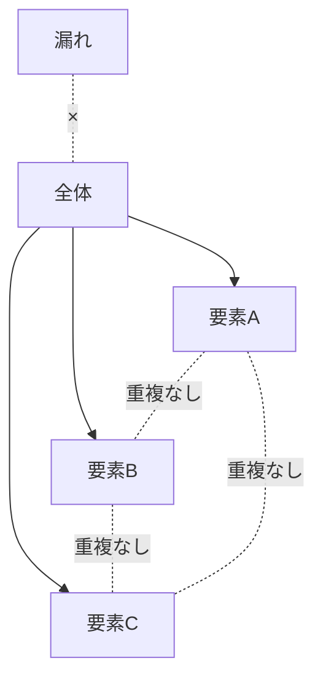
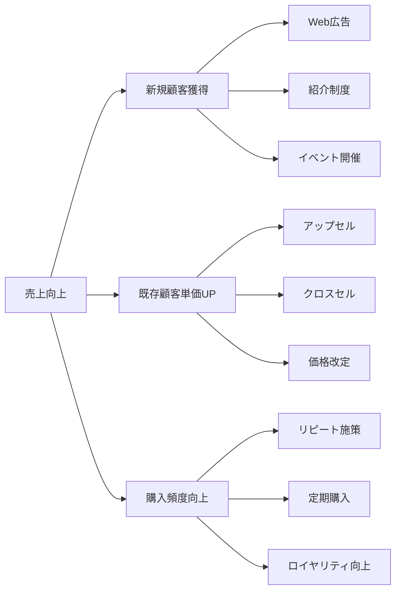

# 第4章：問題解決の論理プロセス

## 学習目標
この章を読み終えると、以下のことができるようになります：
- 問題を正しく設定し定義する
- 仮説思考を使って効率的に問題解決する
- 複数の解決策を論理的に比較検討する
- 意思決定のフレームワークを活用する

## 4.1 問題設定の重要性

### 4.1.1 問題設定とは

**定義**: 解決すべき課題を明確に定義し、解決の方向性を決めること

**問題設定の重要性**
- 的外れな解決策を防ぐ
- 効率的な解決プロセスを可能にする
- チーム全体の方向性を統一する
- 成果測定の基準を提供する

### 4.1.2 問題と課題の違い

**問題（Problem）**
- 現状と理想の間のギャップ
- 「何が起きているか」に焦点
- 事実の把握が中心

**課題（Issue）**
- 問題を解決するために取り組むべきこと
- 「何をすべきか」に焦点
- 行動の方向性が中心

**例**
- 問題：「売上が前年同期比20%減少している」
- 課題：「売上を前年同期レベルまで回復させる」

### 4.1.3 問題設定の5W1H

**What（何が）**: 具体的に何が問題なのか
- 定量的な表現（数値・期間）
- 明確な範囲の設定

**Where（どこで）**: 問題が発生している場所・範囲
- 部署、地域、市場セグメント
- 影響範囲の特定

**When（いつ）**: 問題が発生している時期
- 発生時期の特定
- 解決期限の設定

**Who（誰が）**: 影響を受ける人・関係者
- ステークホルダーの特定
- 責任者の明確化

**Why（なぜ）**: 問題が重要な理由
- ビジネスインパクト
- 解決の必要性

**How（どのように）**: 解決の方向性
- 目標設定
- 制約条件の確認

### 4.1.4 良い問題設定の条件

**SMART原則の適用**
- **S**pecific（具体的）: 明確で具体的
- **M**easurable（測定可能）: 定量的に測定できる
- **A**chievable（達成可能）: 現実的に達成可能
- **R**elevant（関連性）: ビジネス目標と関連
- **T**ime-bound（期限）: 明確な期限設定

**問題設定の例**

**×悪い例**
「売上を向上させたい」

**○良い例**
「Aエリアの新規顧客からの売上を、3ヶ月以内に月額500万円から700万円（40%増）に向上させる」

## 4.2 仮説思考とその検証

### 4.2.1 仮説思考とは

**定義**: 情報が不完全な状況で、最も可能性の高い答えを仮説として設定し、それを検証しながら解決策を見つける思考法

**従来の思考との違い**
- 従来：情報収集 → 分析 → 結論
- 仮説思考：仮説設定 → 検証 → 修正 → 結論

### 4.2.2 仮説設定の方法

**帰納法による仮説構築**
1. 観察可能な事実を収集
2. パターンや傾向を発見
3. 一般化された仮説を構築

**演繹法による仮説構築**
1. 一般的な法則や理論を適用
2. 特定状況への当てはめ
3. 検証可能な仮説を導出

**類推による仮説構築**
1. 類似事例の分析
2. 共通要因の抽出
3. 当該状況への適用

### 4.2.3 仮説の構造

**仮説の基本形**
「○○だから、△△すれば、□□になる」

**具体例**
「顧客の価格感度が高いため（○○）、価格を10%下げれば（△△）、売上が20%向上する（□□）」

**日本企業の実例：ユニクロの価格戦略**
```
ファーストリテイリング（ユニクロ）の仮説思考例：

仮説：「高品質な基本アイテムを低価格で提供すれば、
　　　　ブランド品志向から実用性重視にシフトした消費者の
　　　　支持を得て、売上が大幅に増加する」

検証結果：
- ヒートテック：初年度200万枚→10年後1億枚以上
- フリース：1998年200万枚→2000年2600万枚
- 仮説が正しいことが証明され、SPAモデルを確立
```

**良い仮説の条件**
- 検証可能である
- 具体的で明確である
- 実行可能な施策に結びつく
- データで確認できる

### 4.2.4 仮説検証のプロセス

**1. 検証計画の策定**
- 検証方法の選択
- 必要データの特定
- 成功・失敗の判断基準
- 検証期間の設定

**2. データ収集と分析**
- 量的データの分析
- 質的データの収集
- 複数ソースでの確認
- 客観的な評価

**3. 仮説の評価**
- 予想と実際の比較
- 検証結果の解釈
- 仮説の採択・修正・棄却
- 学習の抽出

**4. 次のアクション決定**
- 仮説が正しい場合：本格実行
- 仮説が間違い場合：修正・新仮説
- 判断が困難な場合：追加検証

## 4.3 複雑問題の構造化手法

### 4.3.1 複雑問題の特徴とAI時代での変化

**複雑問題の定義（2024年版）**
- **多変数連動性**: 複数要因が相互に影響し合う
- **非線形性**: 小さな変化が大きな影響を生み出す可能性
- **動的変化**: 時間経過とともに問題構造が変化
- **ステークホルダー多様性**: 異なる立場・利害の関係者が存在
- **AI影響度**: AI技術の発展による業務・市場環境の急速な変化

**AI時代の複雑問題の特徴**
- **デジタル変革圧力**: DX推進による組織・プロセス変更の必要性
- **スキル格差問題**: AI活用能力の有無による人材格差
- **データ複雑性**: 大量データ処理と個人情報保護の両立
- **倫理的ジレンマ**: AI判断の透明性と効率性のトレードオフ
- **競争環境激変**: AI導入による業界構造の根本的変化

### 4.3.2 構造化手法の体系（AI時代版）

**レベル1: 基本構造化手法**

**MECE分析（強化版）**
- **従来のMECE**: 重複なく漏れなく（Mutually Exclusive, Collectively Exhaustive）
- **AI時代のMECE+**: 時間軸・ステークホルダー軸・技術影響軸を追加
  ```
  顧客セグメント分析例（AI時代版）:
  ├── デジタルネイティブ層（AI活用積極派）
  ├── デジタル移行層（AI学習中）
  ├── デジタル抵抗層（AI回避傾向）
  └── 時間軸：各層の移行パターン予測
  ```

**ロジックツリー（多次元版）**
- **従来**: 縦の階層分解のみ
- **AI時代**: 横の関連性・時系列変化・技術影響を統合
  ```
  売上向上（AI時代版）
  ├── AI活用による効率化
  │   ├── 顧客分析AI導入
  │   ├── 予測分析システム
  │   └── チャットボット対応
  ├── 人間スキル強化
  │   ├── AI協働スキル研修
  │   ├── 創造的問題解決力
  │   └── 倫理的判断力
  └── 技術×人間の融合戦略
      ├── Human-in-the-Loop設計
      ├── AI品質管理体制
      └── 継続学習システム
  ```

**レベル2: 高度構造化手法**

**システム思考アプローチ**
- **因果ループ図**: 要素間の相互影響関係を可視化
- **ストック・フロー図**: 蓄積（ストック）と流れ（フロー）の関係
- **レバレッジポイント特定**: 最小の変化で最大の効果を生む介入点

**複雑適応系（CAS）モデル**
- **エージェントベース**: 個々の要素（エージェント）の行動ルール設定
- **創発性の理解**: 個別最適が全体最適につながらない現象の分析
- **適応的学習**: 環境変化に応じた自己組織化プロセス

**レベル3: AI支援構造化手法**

**機械学習による問題構造発見**
- **クラスター分析**: 類似問題の自動分類
- **主成分分析**: 複雑な要因から主要因子の抽出
- **ネットワーク分析**: 要素間の関係性パターンの発見

**予測モデリング統合**
- **シナリオ分析**: 複数の将来予測に基づく戦略立案
- **感度分析**: 重要パラメータの変化が全体に与える影響度分析
- **モンテカルロシミュレーション**: 不確実性を考慮した確率的分析

### 4.3.3 実践的複雑問題解決プロセス

**フェーズ1: 問題の全体像把握**
1. **ステークホルダーマッピング**: 関係者の利害・影響力分析
2. **問題境界の設定**: 解決範囲の明確化
3. **時間軸の設定**: 短期・中期・長期の影響分析
4. **AI影響度評価**: 技術変化が問題に与える影響度

**フェーズ2: 構造分析と要因特定**
1. **要因分解**: ロジックツリー・MECE分析の適用
2. **因果関係分析**: システム思考による相互影響の特定
3. **重要度・緊急度評価**: 各要因の優先順位付け
4. **制約条件の特定**: 解決の制約となる要因の明確化

**フェーズ3: 解決策の設計と検証**
1. **介入ポイントの特定**: 効果的な変更点の選定
2. **複数シナリオの設計**: 異なるアプローチの比較検討
3. **リスク評価**: 各解決策の潜在的リスク分析
4. **パイロット設計**: 小規模実験による検証計画

**複雑問題解決チェックリスト**
```
□ 問題の境界は適切に設定されているか？
□ 主要ステークホルダーは特定されているか？
□ 要因間の相互影響は考慮されているか？
□ 時間軸での変化は分析されているか？
□ AI技術の影響は評価されているか？
□ 制約条件は明確になっているか？
□ 複数の解決策が検討されているか？
□ リスクと不確実性は評価されているか？
```

### 4.3.4 解決策の発想法（AI時代版）

**従来手法の強化**

**AI支援ブレインストーミング**
- **アイデア生成AI**: ChatGPTなどでの多角的アイデア創出
- **組み合わせ最適化**: 異なるアイデアの自動組み合わせ提案
- **バイアス除去**: AIによる客観的視点の補完
- **国際的視点**: 多言語・多文化的アイデアの取り込み

**デジタル・なぜなぜ分析**
- **データ駆動分析**: ログデータ・行動データに基づく根本原因特定
- **AI予測モデル**: 因果関係の定量的評価
- **リアルタイム分析**: 継続的な原因分析と対策調整
- **パターン認識**: 過去の類似問題からの学習

**ベンチマーキング（AI時代版）**
- **デジタル先進企業**: GAFA、中国テック企業の戦略分析
- **業界横断ベストプラクティス**: 異業種のAI活用成功事例
- **グローバル動向**: 各国のAI戦略・規制動向の把握
- **スタートアップ事例**: 新興企業の革新的アプローチ

**日本企業の事例：トヨタ生産方式（TPS）のAI時代適応**
```
従来のTPS「なぜなぜ分析」のデジタル化進化：

AI時代の「なぜなぜ分析」例：
問題：AI導入後も生産性が向上しない

なぜ1：AIシステムが現場で活用されていない
→ データ分析：システム利用率20%（目標80%）

なぜ2：作業者がAIの判断を信頼していない
→ アンケート分析：78%が「AIの根拠が不明」と回答

なぜ3：AIの説明可能性が不足している
→ ログ分析：判断根拠の表示頻度が低い

なぜ4：Explainable AI機能が実装されていない
→ システム仕様確認：説明機能が要件に含まれていない

なぜ5：AI導入時に現場のニーズが十分に収集されていない
→ 根本対策：現場参加型AI設計プロセスの確立

この事例では、IoTセンサーデータ、利用ログ、従業員アンケートなど
多様なデータソースを統合分析することで、より客観的で
包括的な根本原因特定を実現。
```

## 4.4 デジタルツール連携方法

### 4.4.1 問題解決におけるデジタルツール体系

**データ収集・分析ツール**

**ビジネスインテリジェンス（BI）ツール**
- **Tableau**: データ可視化・ダッシュボード作成
- **Power BI**: Microsoft生態系との統合分析
- **Looker**: リアルタイムデータ分析・共有
- **活用場面**: 売上分析、顧客行動分析、市場トレンド分析

**プロジェクト管理・コラボレーションツール**
- **Notion**: 知識管理・プロジェクト統合管理
- **Miro**: オンラインホワイトボード・視覚的思考
- **Monday.com**: タスク管理・進捗追跡
- **Slack**: チーム連携・情報共有

**AI・機械学習プラットフォーム**
- **Google Cloud AI**: AutoML・予測モデリング
- **AWS SageMaker**: エンドツーエンドML開発
- **Azure Machine Learning**: 企業向けML統合環境
- **DataRobot**: ノーコードML予測モデル構築

### 4.4.2 統合的問題解決ワークフロー

**フェーズ1: 問題発見・定義**
```
データ収集 → 分析・可視化 → パターン発見 → 問題定義
    ↓           ↓            ↓         ↓
Google Forms   Tableau      Python     Notion
Survey Monkey  Power BI     R          Miro
IoTセンサー    Excel        AI分析     Teams
```

**フェーズ2: 解決策生成・検証**
```
アイデア創出 → 構造化分析 → シミュレーション → 意思決定
    ↓           ↓          ↓           ↓
ChatGPT      Miro        Excel       Decision Tree
Claude       MindMeister Monte Carlo  Pugh Matrix
Brainstorm   Lucidchart  Python      Analytic Process
```

**フェーズ3: 実行・監視**
```
計画立案 → 実行管理 → 進捗監視 → 改善実施
   ↓        ↓        ↓        ↓
MS Project Monday.com Tableau   PDCA Cycle
Asana     Jira      Power BI  Continuous
Gantt     Trello    Dashboard  Improvement
```

### 4.4.3 AI支援による高度化手法

**自然言語処理（NLP）活用**
- **テキストマイニング**: 顧客フィードバック・レビュー分析
- **感情分析**: ソーシャルメディア・従業員満足度分析
- **自動要約**: 長文レポート・議事録の要点抽出
- **多言語分析**: グローバル市場での課題発見

**予測分析・機械学習活用**
- **需要予測**: 将来の売上・在庫最適化
- **異常検知**: 品質問題・システム障害の早期発見
- **推薦システム**: 顧客行動予測・パーソナライゼーション
- **分類・クラスタリング**: 顧客セグメント・問題カテゴライゼーション

**コンピュータビジョン活用**
- **画像解析**: 製品品質検査・店舗内行動分析
- **動画分析**: 作業効率分析・安全性監視
- **OCR技術**: 紙文書のデジタル化・データ抽出

### 4.4.4 デジタルツール選定・導入の指針

**ツール選定クライテリア**
1. **機能適合性**: 解決したい問題に対する機能の適合度
2. **統合性**: 既存システム・ツールとの連携可能性
3. **習得コスト**: 学習・導入にかかる時間・労力
4. **拡張性**: 将来的な機能拡張・規模拡大への対応
5. **セキュリティ**: データ保護・プライバシー対応レベル
6. **コスト効率**: 投資対効果・総所有コスト

**段階的導入アプローチ**

**ステップ1: 基礎ツール導入（1〜3ヶ月）**
- データ可視化ツール（Tableau/Power BI）
- コラボレーションツール（Slack/Teams）
- プロジェクト管理ツール（Notion/Monday.com）

**ステップ2: 分析高度化（3〜6ヶ月）**
- 統計分析ツール（Python/R環境構築）
- AIプラットフォーム試用（Google Cloud AI）
- 自動化ツール導入（Zapier/Power Automate）

**ステップ3: 統合・最適化（6〜12ヶ月）**
- カスタムダッシュボード開発
- ML/AI本格運用開始
- プロセス全体の最適化・自動化

**デジタルツール活用チェックリスト**
```
□ 問題解決の目的は明確か？
□ 必要なデータは特定されているか？
□ チームのスキルレベルは確認済みか？
□ 既存システムとの連携は考慮されているか？
□ セキュリティ・プライバシーは確保されているか？
□ ROI（投資対効果）は見込めるか？
□ 継続的な学習・改善計画はあるか？
□ リスク管理・バックアップ計画はあるか？
```

### 図4-1：MECEの概念


### 図4-2：ロジックツリーの基本構造


## 4.5 解決策の比較検討

### 4.5.1 解決策の評価軸

**効果性（Effectiveness）**
- 問題解決への寄与度
- 期待される成果の大きさ
- 目標達成可能性

**効率性（Efficiency）**
- コスト対効果
- 時間対効果
- リソース効率

**実現可能性（Feasibility）**
- 技術的実現性
- 組織的実現性
- 財務的実现性

**リスク（Risk）**
- 失敗確率
- 失敗時の影響
- 不確実性の程度

**持続性（Sustainability）**
- 長期的効果
- 継続可能性
- 組織学習への貢献

### 4.5.2 評価マトリックスの作成

**基本構造**
```
解決策    | 効果性 | 効率性 | 実現性 | リスク | 総合評価
---------|-------|-------|-------|-------|----------
案A      |   4   |   3   |   5   |   2   |   3.5
案B      |   5   |   2   |   3   |   4   |   3.5
案C      |   3   |   5   |   4   |   3   |   3.8
```

**重み付けの考慮**
- 評価軸の相対的重要度
- 状況に応じた重み調整
- ステークホルダーの優先度

**定性的評価の併用**
- 数値化困難な要素
- 直感的な判断
- 経験に基づく評価

## 4.6 意思決定のフレームワーク

### 4.6.1 意思決定の種類

**定型的意思決定**
- ルールや手順が確立
- 過去の経験が活用可能
- 比較的低リスク

**非定型的意思決定**
- 前例がない状況
- 高い不確実性
- 重大な影響を伴う

### 4.6.2 意思決定プロセス

**1. 問題の認識**
- 現状と理想のギャップ
- 意思決定の必要性
- 緊急度・重要度の評価

**2. 情報収集**
- 関連情報の収集
- ステークホルダーの意見
- 制約条件の確認

**3. 選択肢の生成**
- 複数案の検討
- 創造的な選択肢
- 実現可能性の確認

**4. 選択肢の評価**
- 評価基準の設定
- 定量的・定性的評価
- リスク・リターン分析

**5. 意思決定**
- 最適解の選択
- 意思決定理由の明確化
- 責任者の確定

**6. 実行**
- 実行計画の策定
- 進捗モニタリング
- 必要に応じた修正

### 4.6.3 意思決定の支援ツール

**決定木（Decision Tree）**
- 選択肢と結果の視覚化
- 確率と期待値の計算
- 複雑な意思決定の整理

**ペイオフマトリックス**
- 戦略と結果の関係
- 不確実性の考慮
- 最適戦略の選択

**費用便益分析**
- 定量的な比較
- 投資対効果の測定
- 財務的合理性の確認

### 4.6.4 意思決定の質を高める方法

**バイアスの回避**
- 確証バイアス
- アンカリング効果
- 楽観バイアス
- 集団思考

**多角的検討**
- 悪魔の代弁者
- プリモルテム分析
- セカンドオピニオン
- タイムアウト制度

**意思決定の記録**
- 判断根拠の文書化
- 前提条件の記録
- 学習機会の創出
- 説明責任の確保

## 4.7 AI時代の問題解決

### 4.7.1 AIを活用した問題解決

**情報収集段階でのAI活用**
- 大量データの処理
- パターン認識
- 情報の要約・整理
- 関連情報の発見

**解決策生成でのAI活用**
- アイデア生成支援
- 他業界事例の提案
- シミュレーション実行
- 多角的視点の提供

**評価・検証でのAI活用**
- 定量分析の実行
- リスク評価の支援
- 予測モデルの構築
- 結果のモニタリング

### 4.7.2 人間とAIの役割分担

**人間が担う領域**
- 問題設定・定義
- 価値判断・優先順位
- 最終的な意思決定
- 責任の確保

**AIが担う領域**
- データ処理・分析
- パターン発見
- 選択肢の生成
- 影響度の計算

**協働による価値創出**
- AIの分析 + 人間の判断
- データ + 経験・直感
- 効率性 + 創造性
- 速度 + 質

## 章末演習

### 演習4-1：問題設定の練習
以下の状況を、SMART原則に従って適切な問題設定に変換してください：

「最近、社員のモチベーションが下がっているような気がする」

### 演習4-2：仮説設定と検証計画
あなたの職場で実際に発生している問題を1つ選び、以下を作成してください：
1. 仮説の設定（○○だから、△△すれば、□□になる）
2. 検証方法の設計
3. 成功・失敗の判断基準

### 演習4-3：解決策の比較検討
「会議の効率が悪い」という問題に対して：
1. 3つ以上の解決策を提案
2. 5つの評価軸で評価マトリックスを作成
3. 最適解を選択し、理由を説明

### 演習4-4：意思決定プロセスの実践
現在あなたが直面している意思決定を1つ選び、6段階の意思決定プロセスに従って整理してください。

### 演習4-5：AIとの協働設計
演習4-2で設定した問題について、AIと人間の役割分担を設計してください：
1. AIに任せる部分
2. 人間が担当する部分
3. 協働で行う部分

## 理解度チェック

□ 問題を適切に設定し、SMART原則で表現できる
□ 仮説思考のプロセスを理解し実践できる
□ 複数の解決策を体系的に比較検討できる
□ 意思決定のフレームワークを活用できる
□ AI時代の問題解決での人間とAIの役割分担を設計できる

## 次章への橋渡し

この章では論理的な問題解決のプロセスを学びました。次の第5章からは、第2部として生成AIとの効果的な対話術に入ります。これまで学んだ論理的思考を基盤として、AIに適切な指示を出し、効果的に協働する方法を学んでいきます。
