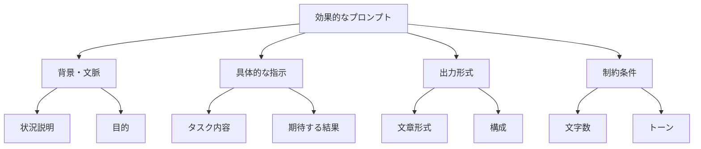
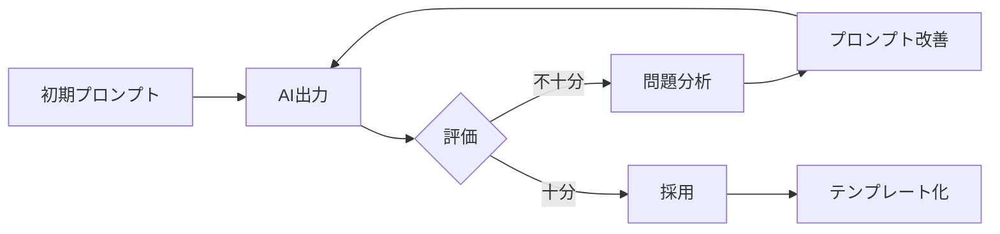

# 第5章：AIへの指示（プロンプト）設計

## 学習目標
この章を読み終えると、以下のことができるようになります：
- 効果的なプロンプトの基本条件を理解する
- 段階的な指示を使ってAIから最適な回答を得る
- 具体例を活用してAIの理解度を向上させる
- 役割設定とコンテキスト提供でAIの性能を最大化する
- 目的別のプロンプトテンプレートを活用する

## 5.1 最新AIモデルの特性と活用法

### 5.1.1 AIモデルの比較（評価軸）

モデル名・料金・コンテキスト長などは変化が速い情報です。本節では、モデル選定で変わりにくい「評価軸」を整理します。

**評価軸（チェックポイント）**
- **品質**: 推論・文章・コード等の品質（自社ユースケースで検証する）
- **入力できる文量**: 長文入力の可否と、長文時の安定性（要約/抽出の精度）
- **ツール連携**: 外部システム（検索、データ処理等）と連携できるか
- **マルチモーダル**: 画像・音声等を扱えるか（利用環境により対応範囲は異なる）
- **速度・安定性**: レイテンシ、失敗時の挙動、再現性
- **コスト**: 課金体系、上限、月次コスト見積もり（運用を含める）
- **データ取り扱い**: ログ保持、学習利用の扱い、リージョン、監査要件
- **提供形態**: SaaS/API、企業向け契約、セルフホスト可能なモデル等
- **日本語品質**: 読解・生成、専門用語、敬語、用語ゆれ

> 注記: 具体モデルの比較は陳腐化しやすいため、本書では評価軸中心に整理します。導入時は、利用するサービスの公式情報で要確認としてください。

### 5.1.2 ビジネス用途別モデル選択指針

**文書作成・編集**
- **重視する観点**: 長文の安定性、構造化出力、敬語品質
- **確認すること**: 既存文書の要約/編集品質、根拠提示、機密情報の扱い

**データ分析・レポート**
- **重視する観点**: 分析手順の説明、検証可能性、出力形式（表/箇条書き等）
- **確認すること**: 計算の再現性、前提の明示、結論の飛躍がないか

**プログラミング・技術**
- **重視する観点**: 実装品質、セキュリティ観点、レビュー適性
- **確認すること**: 依存関係・環境前提の明示、テスト提案、危険な提案の抑止

**情報収集・リサーチ**
- **重視する観点**: 出典提示、一次情報への到達、複数ソース照合
- **確認すること**: 引用の正確性、日付の整合性、誤情報混入の防止

**企業内利用・機密データ**
- **重視する観点**: データ外部送信の制約、監査ログ、権限管理
- **確認すること**: 組織の情報分類ルールに適合するか（外部AI可否の判断）

### 5.1.3 最新AI機能の実践活用

**ツール連携（関数呼び出し等）**
```json
{
  "name": "analyze_sales_data",
  "description": "売上データを分析し、レポートを生成",
  "parameters": {
    "period": "YYYYQ1-Q3",
    "metrics": ["revenue", "growth_rate", "customer_acquisition"],
    "format": "executive_summary"
  }
}
```

**画像理解（Vision等）**
- **チャート・グラフ分析**: 売上グラフから傾向分析
- **文書OCR**: 手書きメモ・PDF文書のデジタル化
- **プレゼン資料分析**: スライド内容の要約・改善提案
- **ワークフロー図解析**: 業務プロセスの最適化提案

**コード実行（データ分析機能等）**
- **データ処理自動化**: CSV/Excel分析の自動化
- **統計分析**: 回帰分析・相関分析の実行
- **可視化**: グラフ・チャート自動生成
- **シミュレーション**: モンテカルロ分析・予測モデル

### 5.1.4 AIモデル活用のセキュリティ・ガバナンス

**企業向けセキュリティ対策**

**データ保護レベル分類**
1. **パブリック**: 一般公開可能な情報（外部AIサービス利用可）
2. **インターナル**: 社内限定情報（プライベートAI環境推奨）
3. **コンフィデンシャル**: 機密情報（オンプレミス・暗号化必須）
4. **リストリクテッド**: 最高機密（AI利用禁止）

**利用ガイドライン例**
```
【レベル1: パブリック情報】
✅ 一般的な業務知識の質問
✅ 公開されている技術情報の分析
✅ マーケティング文案の作成

【レベル2: インターナル情報】
⚠️ 社内データは匿名化してから利用
⚠️ 企業向けプライベート環境を優先
⚠️ ログ・監査機能のあるプラットフォーム使用

【レベル3: コンフィデンシャル情報】
❌ 顧客個人情報の直接入力禁止
❌ 財務データの生データ利用禁止
❌ 特許・研究開発情報の利用禁止
```

**AIガバナンス体制**
- **AI利用委員会**: 利用方針・ガイドライン策定
- **AI安全管理者**: 利用状況監視・インシデント対応
- **部門AI責任者**: 各部門での適切利用推進
- **監査機能**: 定期的な利用状況・効果測定

## 5.2 良いプロンプトの条件（強化版）

### 5.2.1 プロンプトとは

**定義**: AIに対する指示や質問のこと

**プロンプトの重要性**
- AIの回答品質を決定する最重要要素
- 明確な指示 = 期待する結果
- 曖昧な指示 = 予期しない結果
- 投入時間の大部分を占める作業
- **マルチモーダル対応**: テキストに加え画像等を含む指示設計（利用環境により対応範囲は異なる）
- **ツール連携**: AIが外部ツールを呼び出す前提の指示設計（名称はサービスにより異なる）

### 5.2.2 良いプロンプトの5要素

**1. 明確性（Clarity）**
- 具体的で分かりやすい表現
- 専門用語の説明
- 一意に解釈できる内容

**例**
×「売上について分析して」
○「2024年の月別売上データを分析し、前年同期との比較、増減要因、来年の予測を含む報告書を作成して」

**2. 具体性（Specificity）**
- 詳細な条件指定
- 数値・期間の明示
- 成果物の形式指定

**例**
×「提案書を作成して」
○「新商品の販売戦略提案書を、A4で5ページ、市場分析・競合分析・販売計画・収益予測の章立てで作成して」

**3. 完全性（Completeness）**
- 必要な情報をすべて含む
- 背景・制約条件の説明
- 期待する成果の明示

**4. 構造性（Structure）**
- 論理的な順序
- 段階的な指示
- 優先順位の明示

**5. 検証可能性（Verifiability）**
- 結果の良し悪しを判断できる
- 定量的な基準
- 具体的な成功指標

## 5.3 マルチモーダル対応プロンプト設計

### 5.3.1 マルチモーダルAIの活用領域

**マルチモーダルAI（Vision + Language）の特徴**
- **複合的情報処理**: テキスト・画像・音声・動画の統合理解
- **文脈的解釈**: 視覚情報とテキスト情報の相互補完
- **リアルタイム分析**: 動的コンテンツの瞬時分析
- **クロスモーダル生成**: 一つのモダリティから別のモダリティへの変換

**ビジネス活用場面**
1. **資料分析**: プレゼンスライド・図表・チャートの内容理解
2. **品質管理**: 製品画像からの不良検出・品質評価
3. **市場調査**: 広告画像・動画の効果分析
4. **教育・研修**: 動画コンテンツからの要点抽出・理解度測定
5. **業務効率化**: 手書きメモ・ホワイトボードのデジタル化

### 5.3.2 画像+テキスト統合プロンプト設計

**基本構造**
```
【画像説明要求】
この画像を分析し、以下の観点で詳細に説明してください：
1. 基本情報：何が写っているか
2. 定量情報：数値・グラフ・表の内容
3. 傾向分析：パターン・特徴・異常値
4. ビジネス示唆：意思決定への影響

【出力形式指定】
- 構造化された分析レポート形式
- 重要度に応じた優先順位付け
- 具体的なアクション提案
```

**実践例1: 売上グラフ分析**
```
添付の売上推移グラフを分析し、以下の形式で報告してください：

## データ読み取り
- 期間：[自動識別]
- 最高値・最低値：[具体的数値]
- 平均値・中央値：[計算結果]

## トレンド分析
- 全体傾向：上昇/下降/横ばい
- 季節性：定期的なパターンの有無
- 変曲点：急激な変化のある時期

## ビジネス示唆
- 成長要因：好調期の特徴分析
- リスク要因：下降期の原因分析
- 予測：今後3ヶ月の見込み
- 推奨アクション：具体的な改善策
```

**実践例2: 競合他社広告分析**
```
添付の競合他社の広告画像を分析し、マーケティング戦略レポートを作成してください：

## 視覚的要素分析
- デザイン：色使い、レイアウト、フォント
- 画像構成：メイン被写体、背景、配置
- ブランド要素：ロゴ、キャッチコピー、特徴

## メッセージ分析
- 主要訴求点：何を一番アピールしているか
- ターゲット：想定顧客層の特徴
- 感情訴求：どのような感情に訴えているか

## 戦略的示唆
- 差別化ポイント：当社との違い
- 学習点：参考にすべき要素
- 対抗戦略：効果的な対応策
```

### 5.3.3 音声+テキスト統合活用

**音声データ活用場面**
- **会議音声**: 議事録自動生成・要点抽出・アクション項目特定
- **顧客通話**: 感情分析・満足度評価・改善提案
- **プレゼン音声**: 話し方評価・内容分析・改善アドバイス
- **研修音声**: 理解度測定・質問回答・フィードバック

**音声分析プロンプト例**
```
添付の会議音声（60分）を分析し、以下の形式で議事録を作成してください：

## 基本情報
- 会議名：[音声から推定]
- 参加者：[発言者の特定・役割推定]
- 主要議題：[討議内容の整理]

## 内容要約
- 決定事項：具体的な決定内容（担当者・期限付き）
- 課題・懸念：未解決の問題点
- アクション項目：ToDo（担当者・期限・優先度）

## 追加分析
- 発言時間分析：各参加者の発言割合
- 感情分析：議論の雰囲気・対立点
- 改善提案：より効果的な会議運営のための提案
```

### 5.3.4 動画コンテンツ分析

**動画分析の応用領域**
- **教育コンテンツ**: 学習効果測定・改善提案
- **マーケティング動画**: エンゲージメント分析・最適化
- **業務プロセス**: 作業効率分析・改善点特定
- **プレゼンテーション**: 話し方・スライド効果の評価

**動画分析プロンプト設計**
```
添付のプレゼンテーション動画（20分）を分析し、総合評価レポートを作成してください：

## 構造分析
- 全体構成：導入・本論・結論の時間配分
- スライド効果：視覚的サポートの適切性
- 論理展開：主張の一貫性・説得力

## 話し方分析
- 声の特徴：トーン・スピード・明瞭性
- 非言語コミュニケーション：ジェスチャー・表情
- 聴衆との関係：アイコンタクト・相互作用

## 改善提案
- 即座に改善可能な点：技術的修正
- 中期的改善点：スキル向上の方向性
- 長期的成長：プレゼンテーション能力の発展

## 評価点数
- 内容（40点）：[点数と理由]
- 話し方（30点）：[点数と理由]
- 視覚資料（20点）：[点数と理由]
- 全体印象（10点）：[点数と理由]
```

### 5.3.5 マルチモーダル品質管理

**品質確保のチェックポイント**
```
□ 各モダリティの情報が正確に認識されているか？
□ モダリティ間の関連性が適切に理解されているか？
□ 文脈的な解釈に誤りはないか？
□ 出力形式は要求通りに構造化されているか？
□ 実用的なアクション提案が含まれているか？
```

**エラーハンドリング**
- **認識エラー**: 画像・音声の解析失敗時の対応
- **解釈エラー**: 文脈理解の誤りの修正方法
- **統合エラー**: マルチモーダル情報の整合性チェック

## 5.4 プロンプト設計の基本フレームワーク

### 5.4.1 CRISP-P法（強化版）

**CRISP-P法**
- **C**ontext（文脈・背景）
- **R**ole（役割設定）
- **I**nstruction（具体的指示）
- **S**pecification（仕様・制約）
- **P**roduct（成果物の形式）

**テンプレート**
```
【背景】○○の状況で
【役割】△△の専門家として
【指示】□□を実行してください
【制約】※※の条件下で
【成果物】▲▲の形式で提供
```

### 図5-1：効果的なプロンプトの構造


## 5.5 段階的な指示の出し方

### 5.5.1 段階的指示の必要性

**一度に全てを指示する場合の問題**
- 複雑すぎて理解困難
- 重要な要素の見落とし
- 修正が困難
- 品質のばらつき

**段階的指示の利点**
- 各段階での品質確認
- 方向性の調整可能
- 学習効果の向上
- より高品質な成果物

### 5.5.2 段階的指示の設計法

**3段階アプローチ**

**第1段階：概要・方向性の確認**
- 課題の理解確認
- アプローチの提案
- 全体像の共有

**第2段階：詳細設計・構造化**
- 具体的な構成
- 詳細な内容設計
- 品質基準の確認

**第3段階：実行・調整**
- 実際の作成
- 品質チェック
- 必要に応じた修正

### 5.5.3 実践例：企画書作成

**第1段階の指示**
```
新商品の販売企画書を作成したいと考えています。
商品は「健康志向のスナック菓子」で、ターゲットは「30-40代の働く女性」です。
どのような構成と内容で企画書を作成すべきか、提案してください。
```

**第2段階の指示**
```
提案された構成を基に、各章の詳細な内容を設計してください。
特に市場分析と販売戦略の部分は、具体的なデータや施策を含めて
詳しく検討してください。
```

**第3段階の指示**
```
設計された内容に基づいて、実際の企画書を作成してください。
各章は見出しを明確にし、データは表やグラフで視覚化し、
経営陣向けの説得力ある内容にしてください。
```

### 5.5.4 継続的改善の仕組み

**フィードバックループ**
1. 指示 → 回答 → 評価 → 修正指示
2. 期待と実際のギャップ分析
3. 指示方法の改善
4. テンプレート化

**品質向上のポイント**
- 各段階での明確な評価基準
- 具体的な修正指示
- 良い例・悪い例の蓄積
- パターン化による効率化

### 図5-2：プロンプト改善サイクル


## 5.6 具体例を使った指示方法

### 5.6.1 具体例の効果

**抽象的指示の問題**
- AIの解釈にばらつき
- 期待と異なる結果
- 修正に時間がかかる

**具体例使用の利点**
- 期待する品質レベルの明示
- スタイル・形式の統一
- 理解度の向上
- 作業時間の短縮

### 5.6.2 具体例の種類と使い方

**成果物の例示**
```
以下のような形式で報告書を作成してください：

【例】
## 市場分析
- 市場規模：○○億円（前年比△%増）
- 主要競合：A社（シェア30%）、B社（シェア25%）
- 成長要因：健康志向の高まり、在宅勤務の増加

## 販売戦略
1. ターゲット設定：30-40代働く女性（年収400万円以上）
2. チャネル戦略：オンライン販売を主軸とし...
```

**スタイル・トーンの例示**
```
以下のようなトーンで文章を作成してください：

【例】
「本提案は、市場環境の変化に対応し、持続的な成長を実現するための
戦略的取り組みです。データ分析の結果、3つの重要な課題が
明らかになりました...」

（専門的でありながら分かりやすく、自信を持って提案する文体）
```

**データ表現の例示**
```
数値データは以下の形式で表現してください：

【例】
| 項目 | 2023年 | 2024年 | 増減率 |
|------|-------|-------|--------|
| 売上 | 1,000万円 | 1,200万円 | +20% |
| 利益 | 100万円 | 150万円 | +50% |
```

### 5.6.3 Few-Shot Learning の活用

**定義**: 少数の例から学習パターンを理解させる手法

**基本構造**
```
以下の例に従って、同様の形式で○○を作成してください：

【例1】
入力：...
出力：...

【例2】
入力：...
出力：...

【あなたのタスク】
入力：...
出力：？
```

**実践例：メール返信文作成**
```
以下の例に従って、顧客からの問い合わせに対する返信メールを作成してください：

【例1】
問い合わせ：「商品Aの在庫はありますか？」
返信：「お問い合わせありがとうございます。商品Aは現在在庫がございます。
ご注文から3営業日以内に発送いたします。ご不明な点がございましたら...」

【例2】
問い合わせ：「返品は可能ですか？」
返信：「お問い合わせありがとうございます。商品到着から7日以内であれば
返品を承っております。返品の際は事前にご連絡いただき...」

【あなたのタスク】
問い合わせ：「配送料はいくらですか？」
返信：？
```

## 5.7 役割設定とコンテキスト提供

### 5.7.1 役割設定の重要性

**役割設定の効果**
- 専門性の向上
- 一貫した視点
- 適切なトーン・スタイル
- 関連知識の活用

**役割設定の例**
- 「マーケティング専門家として」
- 「プロジェクトマネージャーの立場で」
- 「顧客サービス担当者として」
- 「経営コンサルタントの視点から」

### 5.7.2 効果的な役割設定

**具体的な専門性の指定**
×「専門家として」
○「10年の経験を持つデジタルマーケティング専門家として」

**複数の視点の組み合わせ**
```
あなたは以下の3つの視点を持つ専門家です：
1. マーケティング戦略の専門家（市場分析・競合分析）
2. 財務アナリスト（収益性・投資効果の評価）
3. プロジェクトマネージャー（実行可能性・リスク管理）

この3つの視点から...
```

**業界・企業特性の考慮**
```
あなたは中小製造業（従業員100名、年商30億円）の
経営企画担当者として、限られたリソースの中で
最大の効果を上げる施策を提案してください。
```

### 5.7.3 コンテキスト提供の技術

**背景情報の整理**
- 会社・業界の基本情報
- 現在の状況・課題
- 制約条件・前提条件
- 関係者・ステークホルダー

**時系列情報の提供**
```
【背景】
2022年：新商品Aを発売、初年度売上1億円
2023年：競合他社が類似商品を発売、当社売上20%減
2024年：市場全体が縮小傾向、新たな戦略が必要

【現在の状況】
- 売上：月額6,000万円（前年同期比-15%）
- 在庫：3ヶ月分の過剰在庫
- 競合：5社が市場に参入

この状況で...
```

**制約条件の明示**
```
【制約条件】
- 予算：年間2,000万円以内
- 人員：既存メンバーのみ（新規採用不可）
- 期間：6ヶ月以内に成果を出す必要
- 技術：既存システムの活用が前提

これらの制約の中で...
```

## 5.8 プロンプトテンプレート集

### 5.8.1 分析系テンプレート

**市場分析テンプレート**
```
【役割】市場調査専門家として
【背景】[業界名]業界の[商品・サービス名]について
【指示】以下の観点から市場分析を実施してください：
1. 市場規模と成長性
2. 主要プレイヤーと競合状況
3. 顧客ニーズとトレンド
4. 市場機会と脅威
【制約】信頼できるデータソースを使用し、根拠を明示
【成果物】A4で3ページ程度の分析レポート
```

**問題分析テンプレート**
```
【役割】経営コンサルタントとして
【背景】[問題の概要と発生状況]
【指示】以下の手順で問題分析を行ってください：
1. 問題の構造化（ロジックツリーで分解）
2. 根本原因の特定（5回のなぜ分析）
3. 影響度と緊急度の評価
4. 解決策の優先順位
【制約】MECE原則に従い、客観的データに基づく
【成果物】問題分析シートと解決策ロードマップ
```

### 5.8.2 企画・提案系テンプレート

**企画書作成テンプレート**
```
【役割】事業企画担当者として
【背景】[企画の目的と背景]
【指示】以下の構成で企画書を作成してください：
1. 企画概要（目的・背景・期待効果）
2. 市場分析（機会・競合・顧客ニーズ）
3. 実行計画（スケジュール・体制・予算）
4. 収益予測（売上・コスト・利益）
5. リスクと対策
【制約】実現可能性を重視し、定量的根拠を提示
【成果物】プレゼンテーション用のスライド形式
```

### 5.8.3 コミュニケーション系テンプレート

**メール作成テンプレート**
```
【役割】[職種・立場]として
【背景】[相手との関係性と状況]
【指示】以下の内容を含むメールを作成してください：
- 目的：[メールの目的]
- 要求事項：[相手にお願いしたいこと]
- 期限：[回答・対応期限]
- 次のアクション：[期待する次のステップ]
【制約】丁寧で分かりやすく、簡潔にまとめる
【成果物】件名とメール本文
```

### 5.8.4 学習・改善系テンプレート

**振り返り分析テンプレート**
```
【役割】組織開発コンサルタントとして
【背景】[プロジェクト・業務の概要]
【指示】以下の観点で振り返り分析を行ってください：
1. 成果の評価（目標達成度・品質・効果）
2. プロセスの分析（計画・実行・管理）
3. 学習ポイント（成功要因・改善点）
4. 次回への活用（ベストプラクティス・注意点）
【制約】客観的事実に基づき、具体的な改善策を提示
【成果物】振り返りレポートと改善計画書
```

## 章末演習

### 演習5-1：プロンプトの改善
以下の曖昧なプロンプトを、良いプロンプトの5要素を満たすように改善してください：

「競合他社について調べて報告して」

### 演習5-2：段階的指示の設計
「社内業務の効率化提案書」を作成するための段階的指示を3段階で設計してください。

### 演習5-3：具体例を使った指示
「顧客満足度向上のための施策」を提案してもらうプロンプトを、具体例を含めて作成してください。

### 演習5-4：役割設定とコンテキスト
あなたの職場の実際の課題を1つ選び、適切な役割設定とコンテキスト提供を含むプロンプトを作成してください。

### 演習5-5：テンプレートの活用
5.8のテンプレート集から1つ選び、実際の業務で使用するためにカスタマイズしてください。

## 理解度チェック

□ 良いプロンプトの5要素を理解し適用できる
□ CRISP-P法を使ってプロンプトを構造化できる
□ 段階的指示により効率的に成果物を得られる
□ 具体例を効果的に活用できる
□ 適切な役割設定とコンテキスト提供ができる
□ 目的別のテンプレートを活用・カスタマイズできる

## 次章への橋渡し

この章ではAIに効果的な指示を出す方法を学びました。次の第6章では、AIから得られた出力を適切に評価し、改善していく方法を学びます。AIとの協働において、出力の品質を見極め、より良い結果を得るための技術を身につけましょう。
