# 第6章：AI時代の協働思考とフレームワーク

## 学習目標
この章を読み終えると、以下のことができるようになります：
- AI時代の意思決定フレームワークを理解し活用する
- Human-AI協働思考プロセスを効果的に実践する
- 認知バイアスを認識し、適切な対策を講じる
- データ駆動思考とメタ認知を日常業務に活用する

## 6.1 AI時代の意思決定フレームワーク

現代の複雑な問題解決には、従来の直感的判断だけでは限界があります。AI時代の意思決定フレームワークは、人間の認知能力とAIの計算能力を組み合わせて、より質の高い判断を可能にします。

### 6.1.1 4段階の意思決定プロセス

**1. 問題分析（Problem Analysis）**
- **5W1H分析**: 問題の本質を構造化
- **根本原因分析**: 表面的症状ではなく真の原因を特定
- **AI支援**: 大量データからのパターン抽出

**2. 選択肢生成（Option Generation）**
- **ブレインストーミング**: 創造的アイデア発想
- **シナリオ分析**: 複数の可能性を体系的に検討
- **AI支援**: 過去事例からの提案生成

**3. 評価・判断（Evaluation）**
- **多基準評価**: 複数の観点から総合判断
- **リスク評価**: 不確実性と影響度の定量化
- **人間判断**: 価値観・倫理的配慮の統合

**4. 実行・検証（Implementation）**
- **効果測定**: データに基づく成果確認
- **継続改善**: フィードバックループによる最適化

### 6.1.2 意思決定支援ツール・手法

#### 問題分析ツール
- **SWOT分析**: 内部・外部環境の体系的評価
- **なぜなぜ分析**: 問題の根本原因追究
- **ステークホルダー分析**: 関係者への影響評価

#### 評価・判断ツール
- **意思決定マトリクス**: 重み付き多基準評価
- **コスト・ベネフィット分析**: 投資対効果の定量化
- **リスクアセスメント**: 確率×影響度による評価

#### 戦略的思考ツール
- **ゲーム理論**: 相互作用を考慮した戦略決定
- **シナリオプランニング**: 不確実な未来への対応
- **オプション理論**: 柔軟性の価値評価

#### AI協働ツール
- **データ駆動分析**: 機械学習による予測・分類
- **シミュレーション**: モンテカルロ法による結果予測
- **A/Bテスト**: 実験的検証による最適化

### 6.1.3 認知バイアス対策

意思決定の質を向上させるために、以下の認知バイアスに注意し、適切な対策を講じることが重要です：

- **確証バイアス**: 反証情報を積極的に収集・検討
- **アンカリング**: 初期値に固執せず複数の基準点を設定
- **楽観バイアス**: リスクを適切に評価し、悪いシナリオも考慮
- **集団思考**: 多様な視点を意図的に取り入れ
- **悪魔の代弁者**: 反対意見を積極的に検討

## 6.2 Human-AI協働思考プロセス

AI時代の思考は、人間とAIがそれぞれの強みを活かしながら協働することで、単独では不可能な高度な問題解決を実現します。

### 6.2.1 人間の強み領域

人間が優位性を発揮する思考領域：

#### 創造性・直感的判断
- **創造的思考**: 新しいアイデアやアプローチの創出
- **直感的判断**: 経験と勘に基づく洞察
- **感情理解**: 共感・配慮に基づく判断

#### 価値判断・責任
- **倫理的判断**: 道徳・価値観に基づく選択
- **戦略的思考**: 長期視点での全体最適化
- **最終責任**: 説明責任を伴う意思決定

#### 文脈理解・問題設定
- **文脈理解**: 複雑な背景や微妙なニュアンスの把握
- **問題定義**: 本質的課題の特定と構造化
- **品質評価**: AI出力の妥当性判断

### 6.2.2 AIの強み領域

AIが優位性を発揮する処理領域：

#### 大量データ処理
- **高速分析**: 大量データの瞬時処理
- **パターン認識**: 隠れた関係性の発見
- **24/7稼働**: 疲労なし・一貫性の維持

#### 計算・予測・生成
- **予測・シミュレーション**: 統計的推論による未来予測
- **計算・検索**: 瞬時の情報アクセスと処理
- **コード生成**: 自動プログラミング支援

#### 情報処理・整理
- **文書作成支援**: 構造化・要約・翻訳
- **反復タスク**: 高速・正確・忍耐強い処理
- **多言語対応**: 言語の壁を超えた情報処理

### 6.2.3 協働による相乗効果

人間とAIの協働パターン：

#### Human-in-the-Loop
- 人間による継続的監督・修正
- AIの出力を人間が評価・改善
- 段階的品質向上プロセス

#### AI-Augmented Decision
- AI分析結果に基づく人間の判断
- データ駆動の意思決定支援
- 客観性と主観性のバランス

#### Iterative Refinement
- 段階的改善プロセス
- 人間とAIの相互フィードバック
- 継続的学習による性能向上

#### Explainable AI
- AI判断の説明可能性確保
- 透明性のある意思決定プロセス
- 信頼性の高い協働関係構築

## 6.3 実践的活用方法

### 6.3.1 日常業務での応用

**会議・プレゼンテーション**
- 事前準備：AIによる資料収集・整理
- 本番：人間による創造的議論・意思決定
- 事後：AIによる議事録作成・フォローアップ

**プロジェクト管理**
- 計画：AIによるスケジュール最適化
- 実行：人間による状況判断・調整
- 評価：AIによるデータ分析・人間による総合評価

**問題解決**
- 分析：AIによるデータマイニング・パターン発見
- 発想：人間による創造的解決策検討
- 検証：AIによるシミュレーション・人間による現実性評価

### 6.3.2 チーム・組織での活用

**多様性の活用**
- 異なる背景・専門性を持つメンバーとAIの組み合わせ
- 認知バイアスの相互補完
- 集合知の最大化

**継続的学習**
- AIと人間の相互フィードバック
- 成功・失敗事例の蓄積・共有
- 組織的な思考力向上

## 章末演習

### 演習6-1：意思決定フレームワークの実践
あなたが直面している具体的な問題について、AI時代の意思決定フレームワークを適用してください：
1. 問題分析（5W1H、根本原因）
2. 選択肢生成（最低3つ）
3. 多基準評価（重み付き評価）
4. 実行計画と効果測定方法

### 演習6-2：Human-AI協働の設計
具体的な業務について、人間とAIの役割分担を設計してください：
1. 人間が担当すべき部分とその理由
2. AIが担当すべき部分とその理由
3. 協働による相乗効果の期待
4. 品質管理・リスク対策

### 演習6-3：バイアス対策の実践
最近行った重要な判断について、認知バイアスの影響を分析してください：
1. どのようなバイアスが働いていた可能性があるか
2. そのバイアスがどのような影響を与えたか
3. より良い判断のためには何ができたか
4. 今後の対策

## 理解度チェック

□ AI時代の意思決定4段階プロセスを説明できる
□ 主要な意思決定支援ツールを適切に選択・活用できる
□ 認知バイアスを認識し、適切な対策を講じることができる
□ Human-AI協働の役割分担を効果的に設計できる
□ 協働による相乗効果を具体的に説明できる

## 次章への橋渡し

この章では、AI時代の協働思考とフレームワークを学びました。これらの概念と手法を基盤として、次章以降では具体的な業務場面での応用と実践方法を詳しく学んでいきます。