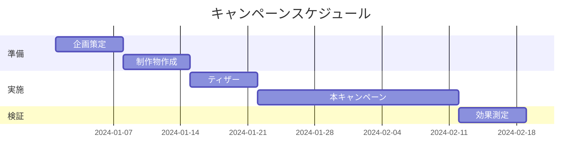

# 職種別実践テンプレート集

## 1. 営業職向けテンプレート

### 1.1 顧客提案書作成テンプレート

#### ステップ1：顧客課題の整理
```
【AIへの指示テンプレート】
以下の情報から、顧客の潜在的な課題を5つ抽出してください：
- 業界：[業界名]
- 企業規模：[従業員数、売上規模]
- 現在の状況：[具体的な状況]
- 競合環境：[主要競合と市場ポジション]
```

#### ステップ2：ソリューション設計
```
【AIへの指示テンプレート】
抽出した課題に対して、以下の観点でソリューションを提案してください：
1. 即効性のある対策（3ヶ月以内）
2. 中期的な改善策（6ヶ月〜1年）
3. 長期的な変革案（1年以上）
各提案には、期待効果と必要リソースを明記してください。
```

#### ステップ3：ROI算出
```
【計算式テンプレート】
投資対効果（ROI）= (利益増加額 - 投資額) ÷ 投資額 × 100

【AIへの指示】
以下の前提で3年間のROIを計算してください：
- 初期投資：[金額]
- 運用コスト：[年額]
- 期待される売上増加：[％または金額]
- コスト削減効果：[％または金額]
```

### 1.2 商談議事録テンプレート

```markdown
# 商談議事録

## 基本情報
- 日時：2024年○月○日 ○時〜○時
- 場所：[場所/オンライン]
- 参加者：
  - 先方：[役職・氏名]
  - 当方：[役職・氏名]

## 商談目的
[1-2行で簡潔に]

## 議論内容
### 1. 顧客の現状と課題
- 現状：
- 主な課題：
- 優先順位：

### 2. 提案内容
- 提案概要：
- 顧客の反応：
- 懸念事項：

### 3. 競合情報
- 検討中の他社：
- 比較ポイント：

## 決定事項
1. [決定事項1]
2. [決定事項2]

## Next Action
- [ ] [担当者] [アクション内容] [期限]
- [ ] [担当者] [アクション内容] [期限]

## 所感・戦略メモ
[今後の進め方、注意点など]
```

## 2. マーケティング職向けテンプレート

### 2.1 市場分析レポートテンプレート

```
【AIへの段階的指示】

1. 市場規模分析
「[業界名]の日本市場規模について、過去3年の推移と今後3年の予測を表形式でまとめてください。情報源も明記してください。」

2. 競合分析
「[業界名]の主要プレイヤー5社について、以下の項目で比較表を作成してください：
- 市場シェア
- 主力商品/サービス
- 価格帯
- 強み/弱み
- 最近の動向」

3. 顧客セグメント分析
「[商品/サービス]のターゲット顧客を以下の軸でセグメント化してください：
- デモグラフィック（年齢、性別、収入等）
- サイコグラフィック（価値観、ライフスタイル等）
- 行動特性（購買頻度、利用シーン等）」

4. SWOT分析
「これまでの分析を基に、当社のSWOT分析を作成してください。各項目3-5個ずつ挙げてください。」
```

### 2.2 キャンペーン企画書テンプレート

````markdown
# [キャンペーン名] 企画書

## 1. キャンペーン概要
- **目的**：[売上向上/認知拡大/新規獲得等]
- **期間**：20XX年○月○日〜○月○日
- **予算**：○○万円
- **目標KPI**：
  - [KPI1]：[数値目標]
  - [KPI2]：[数値目標]

## 2. ターゲット設定
### メインターゲット
- 属性：[年齢、性別、職業等]
- ニーズ：[具体的なニーズ]
- 行動特性：[購買行動、メディア接触等]

### サブターゲット
[必要に応じて設定]

## 3. キャンペーン内容
### メッセージ
- メインコピー：「」
- サブコピー：「」
- 訴求ポイント：

### オファー内容
- [特典1]
- [特典2]

### 実施チャネル
| チャネル | 施策内容 | 予算配分 | 期待効果 |
|---------|---------|---------|---------|
| Web広告 | | ○% | |
| SNS | | ○% | |
| メール | | ○% | |

## 4. スケジュール


## 5. 効果測定方法
- 測定指標：
- 測定ツール：
- レポート頻度：
````

## 3. 人事職向けテンプレート

### 3.1 採用要件定義テンプレート

```
【ポジション要件整理】

## 基本情報
- 職種：[職種名]
- 部署：[部署名]
- 雇用形態：[正社員/契約社員/パート]
- 想定年収：[下限]万円〜[上限]万円

## 業務内容
### 主要業務（コア業務）
1. [業務内容]（業務割合：○%）
2. [業務内容]（業務割合：○%）
3. [業務内容]（業務割合：○%）

### 付随業務
- [業務内容]
- [業務内容]

## 必要スキル・経験
### 必須要件（MUST）
- [具体的な経験・スキル]
- [具体的な経験・スキル]

### 歓迎要件（WANT）
- [あれば望ましい経験・スキル]
- [あれば望ましい経験・スキル]

### 求める人物像
- [性格・志向性]
- [性格・志向性]

## 選考プロセス
1. 書類選考（○営業日以内）
2. 一次面接（人事：適性確認）
3. 二次面接（現場責任者：スキル確認）
4. 最終面接（役員：カルチャーフィット）

## 評価基準
| 評価項目 | 配点 | 評価ポイント |
|---------|------|-------------|
| 専門スキル | 40% | |
| 経験 | 30% | |
| 人物面 | 20% | |
| 成長可能性 | 10% | |
```

### 3.2 面接評価シートテンプレート

```markdown
# 面接評価シート

## 候補者情報
- 氏名：
- 応募職種：
- 面接日：
- 面接官：

## 評価項目（5段階評価）

### 1. 専門スキル・知識
- [ ] 5：期待を大きく上回る
- [ ] 4：期待を上回る
- [ ] 3：期待通り
- [ ] 2：やや不足
- [ ] 1：大きく不足

**具体的な評価理由：**


### 2. コミュニケーション力
- [ ] 5：非常に優れている
- [ ] 4：優れている
- [ ] 3：標準的
- [ ] 2：やや課題あり
- [ ] 1：課題が多い

**具体的な評価理由：**


### 3. 論理的思考力
- [ ] 5：非常に優れている
- [ ] 4：優れている
- [ ] 3：標準的
- [ ] 2：やや課題あり
- [ ] 1：課題が多い

**質問と回答例：**


### 4. カルチャーフィット
- [ ] 5：非常に適合
- [ ] 4：適合
- [ ] 3：問題なし
- [ ] 2：やや懸念
- [ ] 1：適合しない

**判断理由：**


## 総合評価
- [ ] 強く推薦
- [ ] 推薦
- [ ] 保留
- [ ] 不採用推奨

## 懸念事項・確認事項

## 次回面接での確認推奨事項
```

## 4. 経営企画職向けテンプレート

### 4.1 事業計画書テンプレート

```
【AI活用による事業計画作成フロー】

1. 市場機会分析
「[事業領域]における市場機会を、PEST分析のフレームワークで整理してください」

2. ビジネスモデル設計
「[事業コンセプト]を実現するビジネスモデルを、ビジネスモデルキャンバスの9要素で整理してください」

3. 収支計画作成
「以下の前提条件で、3年間の収支計画を作成してください：
- 初期投資：[金額]
- 変動費率：[%]
- 固定費：[月額]
- 成長率：[年率%]」

4. リスク分析
「この事業計画における主要リスクを5つ挙げ、それぞれの対策を提案してください」
```

### 4.2 経営会議資料テンプレート

```markdown
# [議題] に関する提案

## エグゼクティブサマリー
[3行以内で提案の要点をまとめる]

## 背景と課題
### 現状
- [ファクト1]
- [ファクト2]
- [ファクト3]

### 課題
1. **[課題1]**
   - 影響：[定量的/定性的影響]
   - 原因：[根本原因]

2. **[課題2]**
   - 影響：[定量的/定性的影響]
   - 原因：[根本原因]

## 提案内容
### 概要
[提案の全体像を1段落で]

### 具体的施策
| 施策 | 内容 | 期待効果 | 必要リソース | 優先度 |
|------|------|----------|--------------|--------|
| 施策1 | | | | 高/中/低 |
| 施策2 | | | | 高/中/低 |
| 施策3 | | | | 高/中/低 |

## 実行計画
### フェーズ1（[期間]）
- [実施内容]
- マイルストーン：[具体的な成果物/数値]

### フェーズ2（[期間]）
- [実施内容]
- マイルストーン：[具体的な成果物/数値]

## 投資対効果
- 必要投資額：○○万円
- 期待効果：
  - 定量効果：[売上/コスト削減等]○○万円
  - 定性効果：[ブランド向上等]
- 投資回収期間：○ヶ月

## リスクと対策
| リスク | 発生確率 | 影響度 | 対策 |
|--------|----------|--------|------|
| | 高/中/低 | 大/中/小 | |

## 意思決定事項
1. [本提案の承認可否]
2. [予算の承認]
3. [実行体制の承認]

## 添付資料
- 詳細分析データ
- 他社事例
- 詳細スケジュール
```

## 活用のポイント

1. **カスタマイズ前提**
   - 各テンプレートは基本形
   - 業界・企業特性に応じて調整

2. **AI活用の組み込み**
   - 各ステップでAIを活用
   - 人間の判断ポイントを明確化

3. **継続的改善**
   - 使用後のフィードバックを反映
   - チーム内でのベストプラクティス共有

4. **品質チェック**
   - テンプレート使用後も必ず検証
   - 定期的なテンプレート見直し
