# 図表・視覚資料集

## 第1章：AI時代の論理的思考

### 図1-1：AI活用による業務変化
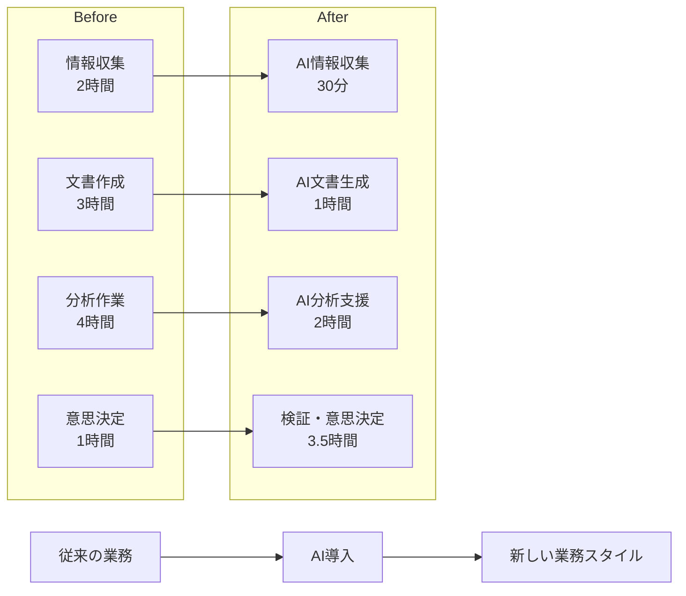

### 図1-2：人間とAIの役割分担
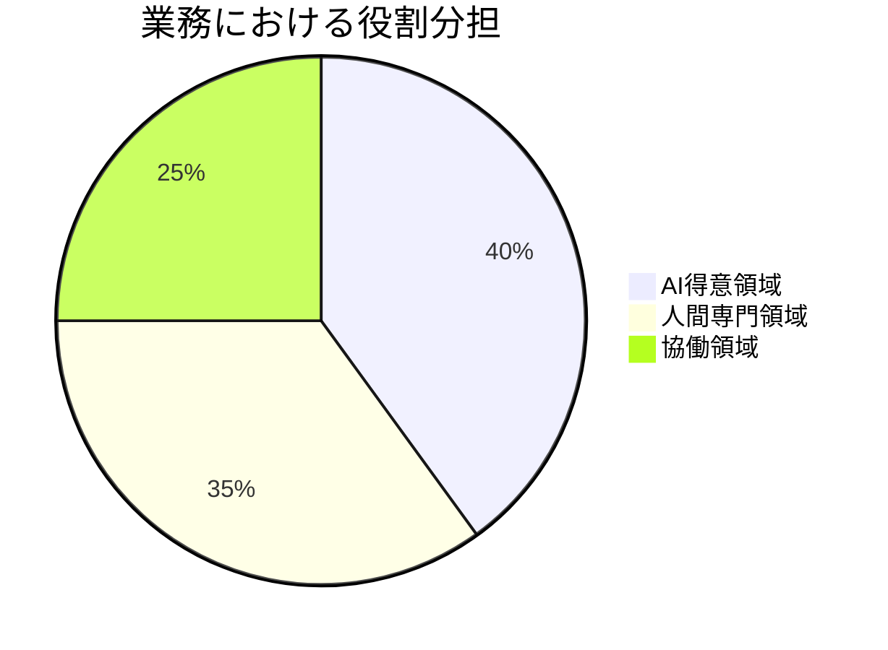

## 第2章：論理的思考の構造

### 図2-1：論理的思考の3要素
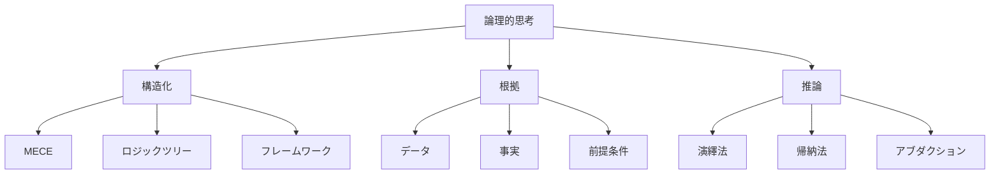

### 図2-2：演繹法と帰納法の違い
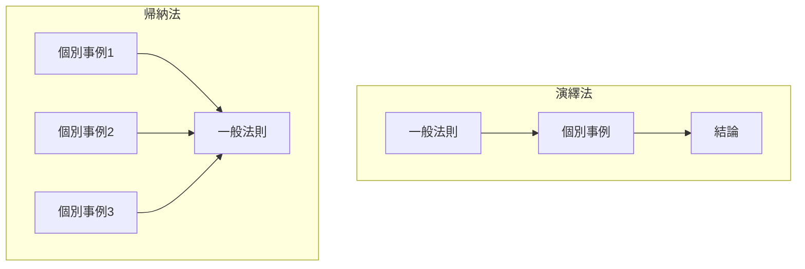

## 第3章：AI時代の情報処理

### 図3-1：情報の信頼性評価マトリクス
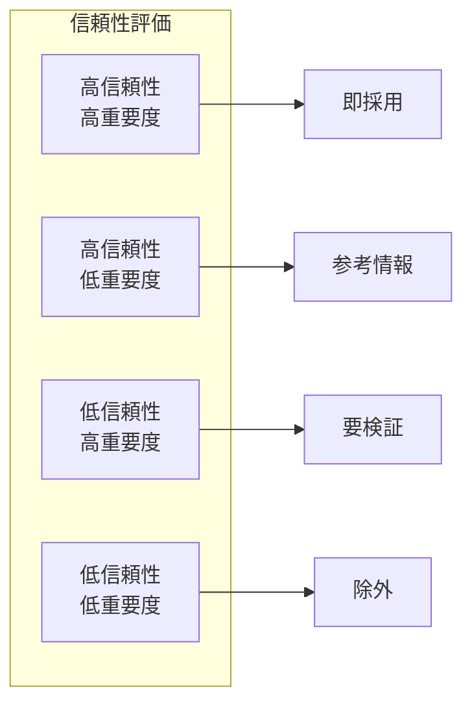

### 図3-2：AIハルシネーション対策フロー
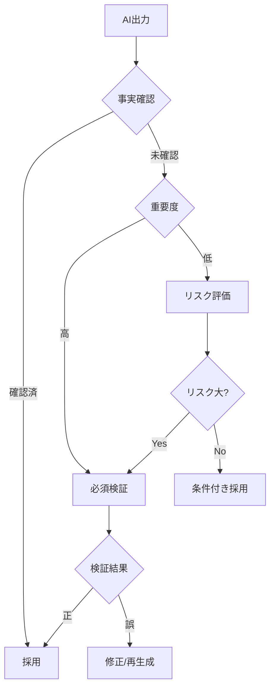

## 第4章：構造化思考

### 図4-1：MECEの概念
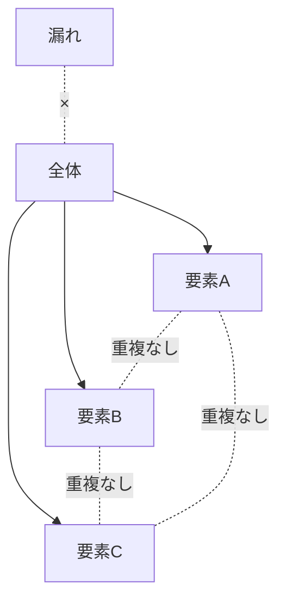

### 図4-2：ロジックツリーの基本構造
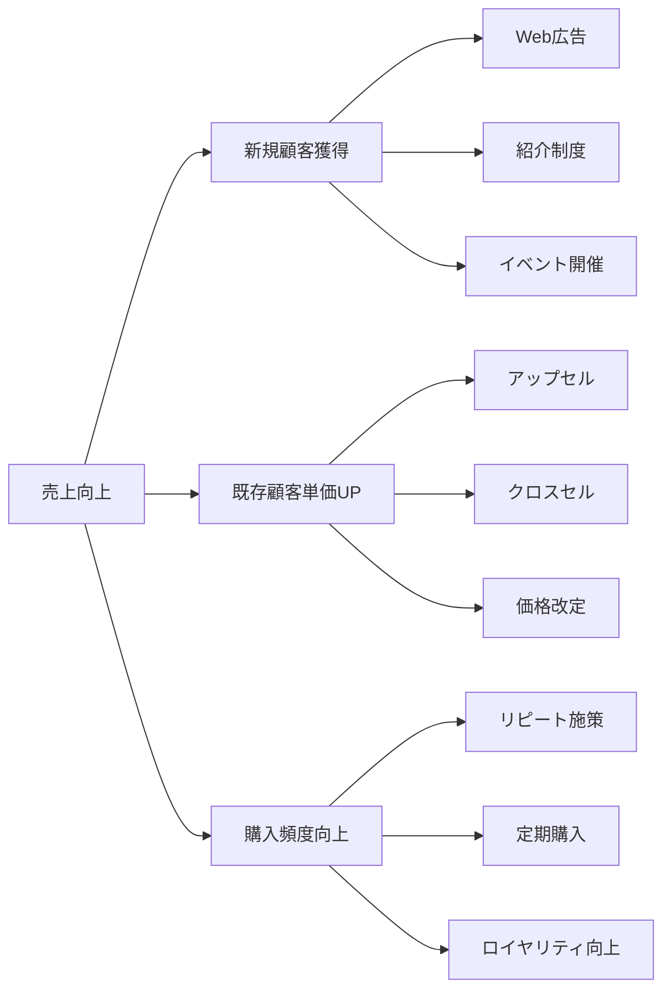

## 第5章：プロンプトデザイン

### 図5-1：効果的なプロンプトの構造
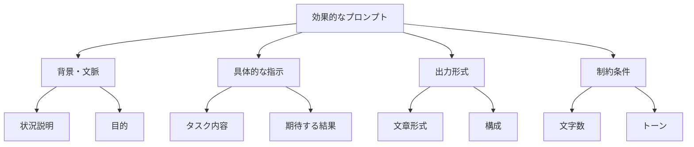

### 図5-2：プロンプト改善サイクル
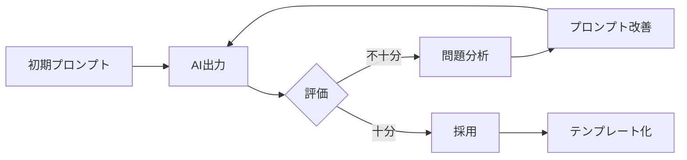

## 第8章：実践的AI活用

### 図8-1：AI活用の成熟度モデル
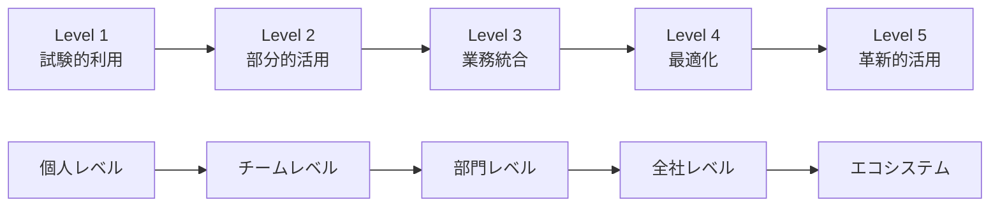

### 図8-2：AI協働のワークフロー
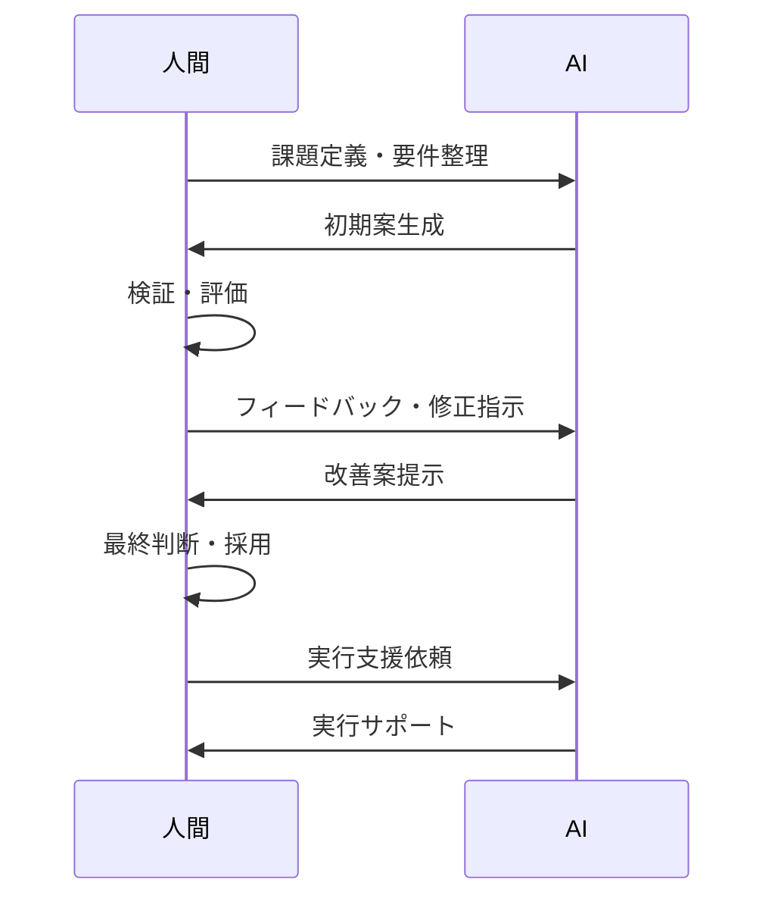

## 活用方法

これらの図表は以下の方法で書籍に組み込みます：

1. **Mermaid記法**をそのまま使用（Markdown対応環境）
2. **画像エクスポート**して挿入（印刷版）
3. **インタラクティブ版**として Web版で提供

各図表には以下を付記：
- 図番号とタイトル
- 簡潔な説明文
- 関連する本文ページ参照